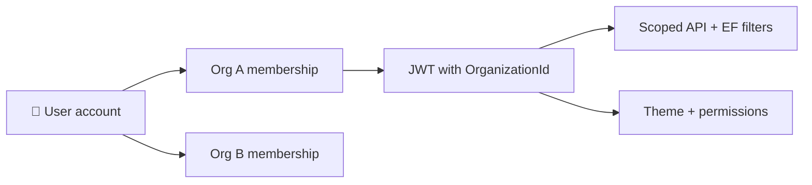

# 🏛️ Omada Platform

> **One platform. Many organizations. Your colors, your widgets, your world.**

Omada is a **multi-tenant SaaS** built for **universities and corporate organizations** — schedules, announcements, tasks, rooms, campus maps, directory, grades, attendance, digital ID, and more in a single, beautifully themed experience.

Each user account can belong to **multiple organizations**. Switching orgs feels like switching **instances**: theme, branding, permissions, and data all follow the active organization.

---

## ✨ What makes Omada special

| Feature | Description |
|---------|-------------|
| 🎨 **Org theming** | Primary / secondary / tertiary colors from your logo — Claymorphism UI on mobile |
| 🧩 **Widget dashboard** | Bento grid home screen — enable features org-wide, control access per role |
| 🏢 **Multi-tenant** | JWT + EF global filters — data isolation by `OrganizationId` |
| 🔐 **Widget RBAC** | View → Edit → Admin per widget; SuperAdmin bypass |
| 🔗 **Invite system** | Unique invite code + link per org; email invites at registration |
| 🔐 **Account security** | Change password, forgot/reset email links, optional **email OTP 2FA** at sign-in |
| 🕷️ **Schedule import** | Scrape public timetables → map to Omada → apply patterns → publish — [`docs/WebSpider.md`](docs/WebSpider.md) · [`docs/Timetables.md`](docs/Timetables.md) |
| 🗺️ **Map & floorplans** | Locations → levels → rooms; optional floorplan AI (Roboflow); campus GPS + indoor coords |
| ⚡ **Real-time** | SignalR for announcements (posts + comments); hub pauses on mobile background — [`docs/Announcements.md`](docs/Announcements.md) |
| 🔍 **Universal search** | Cross-widget search scoped to permissions — [`Backend.md`](Backend.md#-universal-search) · [`Frontend.md`](Frontend.md#-universal-search) |
| 📚 **Curriculum offerings** | Reusable course packages, apply to academic terms, instructor assignment — [`docs/CurriculumOfferings.md`](docs/CurriculumOfferings.md) |
| 📅 **Native timetables** | Weekly patterns, conflict preview, publish to member Schedule, **republish** (replaces all term events per course), combined same-slot groups, wall-clock timezone — [`docs/Timetables.md`](docs/Timetables.md) |
| 📝 **Coursework & grading** | Batched assignments, student turn-in, teaching workspace, batch grading — [`docs/Coursework.md`](docs/Coursework.md) |
| 📊 **Grades & transcript** | Coursework standing (1–10), credits, teacher gradebook — [`docs/Grades.md`](docs/Grades.md) |
| ✅ **Attendance** | University roll + offering breakdown; corporate clock in/out — [`docs/Attendance.md`](docs/Attendance.md) |

---

## 🛠️ Tech stack

| Layer | Technologies |
|-------|--------------|
| **Backend** | ASP.NET Core (.NET 8), EF Core, SQL Server, NSwag, FluentValidation, SignalR, Hangfire, Serilog |
| **Mobile / web app** | React Native (Expo Router), React Query, Zustand, NSwag-generated Axios client |
| **AI / ingestion** | Roboflow (floorplan segmentation), Google Gemini (spider fallback), HtmlAgilityPack |
| **Optional** | Next.js 16 placeholder at `src/frontend/web` — **not** the main product UI |

---

## 📁 Repository structure

```text
omada-platform/
├── 📄 README.md                    ← You are here
├── 📚 docs/                        ← Full documentation hub
│   ├── README.md                   ← Start here for docs index
│   ├── Architecture.md             ← Big-picture system design
│   ├── Configuration.md            ← .env, appsettings, setup
│   ├── Backend.md                  ← API structure & features
│   ├── Frontend.md                 ← Mobile app structure & routes
│   ├── AccountSecurity.md          ← Password, reset links, email OTP 2FA
│   ├── CurriculumOfferings.md      ← Periods, packages, apply/revert
│   ├── DigitalId.md               ← Pass, scanner, attendance
│   ├── Documents.md               ← Corporate file library
│   ├── Announcements.md           ← Channels, posts, comments, SignalR
│   ├── Timetables.md               ← Build, preview, publish, member Schedule
│   ├── Coursework.md               ← Post, turn-in, grade, teach workspace
│   ├── Grades.md                   ← Standing, transcript, credits, teacher gradebook
│   ├── Attendance.md               ← Roll, offering breakdown, work time, instance dates
│   └── WebSpider.md                ← Crawling & sync deep dive
│
├── ⚙️ src/backend/
│   ├── Omada.sln
│   └── Omada.Api/                  ← Main REST API (everything lives here)
│       ├── Controllers/            ← 23 HTTP controllers
│       ├── Services/               ← Business logic
│       ├── Entities/ + Data/       ← EF Core + migrations
│       ├── DTOs/ + Validators/     ← API contracts
│       ├── Infrastructure/         ← Auth, tenancy, Hangfire, middleware
│       └── Hubs/                   ← SignalR
│
└── 📱 src/frontend/
    ├── mobile/                     ← ⭐ Primary client (iOS, Android, Expo web)
    │   ├── src/app/                ← Expo Router (thin routes)
    │   ├── src/screens/            ← All feature UI
    │   ├── src/components/         ← Clay design system
    │   └── src/api/                ← NSwag generated client
    └── web/                        ← Optional Next.js placeholder
```

> 💡 **No separate Python service** — floorplan AI runs inside `Omada.Api`.

---

## 🚀 Quick start (local development)

Full setup guide: **[`docs/Configuration.md`](docs/Configuration.md)**

### Prerequisites

- ✅ .NET 8 SDK
- ✅ Node.js (LTS)
- ✅ SQL Server or LocalDB (Development uses LocalDB by default)
- ✅ Expo tooling (Android Studio / Xcode as needed)
- 🔑 Roboflow API key — only if you use **floorplan AI** in map admin

### 1️⃣ Backend API

```bash
cd src/backend/Omada.Api
copy .env.example .env
# Edit .env — set ROBOFLOW_API_KEY if using floorplan AI
dotnet restore
dotnet run
```

| Resource | URL |
|----------|-----|
| 📖 Swagger | `http://localhost:5069/swagger` |
| ⏰ Hangfire | `http://localhost:5069/hangfire` |

### 2️⃣ Mobile app

```bash
cd src/frontend/mobile
copy .env.example .env
# Set EXPO_PUBLIC_API_BASE_URL (LAN IP on physical device)
npm install
npm run start
```

Press **`w`** for Expo web · **`a`** for Android · **`i`** for iOS

### 3️⃣ Generate TypeScript API client

With the API running:

```bash
cd src/frontend/mobile
npm run generate-api
```

Reads Swagger → writes `src/api/generatedClient.ts` (never edit by hand).

---

## 🧠 Product model (high level)

### Organizations & tenancy



- **Organization** — tenant with theme, enabled widgets, invite code
- **User** — global account; can belong to many orgs
- **Active org** — drives theme, permissions, and API scoping
- **Invites** — share link/code or email invites; join via `POST /api/Auth/join`

### Widgets & permissions (two layers)

1. **Org widget catalog** — which **optional** features are enabled org-wide (`Organization.EnabledWidgetKeysJson`). **New orgs start with `"[]"`** (no optional widgets until toggled in **`/widgets-workspace`**). **Legacy `null`** = all catalog widgets for org type enabled. Filtered by **organization type** (university vs corporate). **Always on** (not stored/toggled): **schedule**, **tasks**, **digital ID**. **Not product widgets:** events, transport, finance. **Groups** is admin RBAC only (not a member catalog toggle).
2. **Role permissions** — per-role **View → Edit → Admin** on widgets allowed for the org (catalog + always-on + groups for admin roles)

| Catalog (toggleable) | University | Corporate | Both |
|------------------------|------------|-----------|------|
| Type-specific | grades, assignments | documents | — |
| Shared | — | — | announcements, attendance, users, map, rooms |

When an org admin **deletes a custom role**, members move to a **holding role** (`Unassigned` or `Member`) until reassigned in the Members workspace — not onto another custom role.

**Organization registration (mobile):** 3-step wizard at **`/register-flow`** (Org → Admin → Branding) → success screen → admin console. Widget catalog, roles, and invites are configured via the **org admin onboarding checklist** (`/org-dashboard`), not during registration.

Enforced with `[HasPermission]` on controllers. **SuperAdmin** bypasses widget checks and can enter any active org.

Examples: `schedule`, `tasks`, `digital-id`, `announcements`, `map`, `rooms`, `grades`, `assignments`, `documents`, `admin`, `super-admin` (legacy: `chat`, `news` → `announcements`)

### Admin surfaces

| Role | Mobile route | API prefix |
|------|--------------|------------|
| 🏛️ Org admin | `/org-dashboard` + workspaces (members, roles, branding, groups, **locations & maps**, event types, periods, spider, widgets, audit — **fullBleed** on web). Toggle **Member app** ↔ **Admin console** on profile screens when user is org admin. | `/api/Organizations/current`, `/api/Maps`, `/api/Rooms`, `/api/floorplans` |
| 🌐 Platform admin | `/admin-dashboard` | `/api/super-admin` |

---

## 📚 Documentation map

| Document | What's inside |
|----------|---------------|
| 📚 [`docs/README.md`](docs/README.md) | **Documentation hub** — index of all guides |
| 🏗️ [`docs/Architecture.md`](docs/Architecture.md) | System design, data flow, tenancy, permissions |
| ⚙️ [`docs/Backend.md`](docs/Backend.md) | API folders, 23 controllers, services, entities |
| 📱 [`docs/Frontend.md`](docs/Frontend.md) | Mobile routes, Clay UI, widgets, org admin layout & workspaces |
| 🔧 [`docs/Configuration.md`](docs/Configuration.md) | `.env`, appsettings, checklist for new clones |
| 🔐 [`docs/AccountSecurity.md`](docs/AccountSecurity.md) | Change password, forgot/reset, email OTP 2FA |
| 🪪 [`docs/DigitalId.md`](docs/DigitalId.md) | Member pass (QR), staff scanner, attendance integration |
| 📁 [`docs/Documents.md`](docs/Documents.md) | Corporate file library — upload sheet, folders, storage |
| 📣 [`docs/Announcements.md`](docs/Announcements.md) | Channels, posts, comments, unread, SignalR, legacy chat/news |
| ✅ [`docs/Attendance.md`](docs/Attendance.md) | University roll, offering breakdown, corporate work time |
| 🕷️ [`docs/WebSpider.md`](docs/WebSpider.md) | Timetable import, Hangfire, Gemini |
| 📱 [`src/frontend/mobile/TUTORIAL.md`](src/frontend/mobile/TUTORIAL.md) | End-user flows (registration, invites, daily use) |

---

## 🗺️ Locations, maps & floorplans (org admin)

**Workspace:** **`/floorplan-workspace`** (nav: **Locations & maps**). Sole admin path for sites, levels, rooms, and optional floorplans.

| Step | What | API / UI |
|------|------|----------|
| 📍 **Location** | Name, address, **campus map pin** (lat/lng) | `POST/PUT .../buildings` · **`LocationPinPicker`** on map |
| 🏢 **Level** | Floor number — image optional | `POST .../floors` (multipart; **`FloorplanFile` optional**) |
| 🚪 **Rooms (no image)** | List: add, **edit**, remove | `roomsApi` + **`LocationFloorRoomsPanel`** |
| 📐 **Floorplan (optional)** | Image, AI, polygons, pins, publish | `FloorplansController` · editor mode in same workspace |
| 🗺️ **Campus widget** | Outdoor markers | Only buildings with **latitude + longitude** |

**Two coordinate systems:** GPS on **`Building`** (campus map) vs normalized **`[0..1]`** on floorplan images (indoor).

**Floorplan AI (optional):** Roboflow → GeoJSON · requires **`map` Admin** + **`ROBOFLOW_API_KEY`**.

Details: [`docs/Frontend.md`](docs/Frontend.md) · [`docs/Backend.md`](docs/Backend.md) · rules **`domain-map-rooms-admin.mdc`**

---

## 🕷️ Schedule import (web spider)

Crawl public HTML timetables, map scraped labels to Omada (event types, hosts, rooms, groups, offerings), and apply weekly patterns — then **publish** for member Schedule.

| Resource | Link |
|----------|------|
| Import flow & mapping | [`docs/WebSpider.md`](docs/WebSpider.md) |
| Native build & publish | [`docs/Timetables.md`](docs/Timetables.md) |
| Admin UI | `/timetables-workspace?tab=import` (legacy `/web-spider-workspace` redirects here) |
| API | `/api/web-spider/*` — import-resolution + apply-to-offering require **Org Admin** |

> **News spider removed** from admin — schedule import only (under **Timetables → Import**). News **widget** unchanged. No **Integrations** nav section.

---

## 📋 Development conventions

| Rule | Why |
|------|-----|
| **Vertical slices** | Entity → Service → Controller → DTO → Swagger → `generate-api` → hook → UI |
| **API envelopes** | Always `ServiceResponse<T>` + `AppError` |
| **Tenancy** | Never bypass org filters without explicit reason |
| **Secrets** | Only in `.env` / host config — never committed |
| **One API process** | Only one `Omada.Api` instance — stop stale processes if build locks |

---

## 🤝 Contributing mindset

Omada favors **clarity over cleverness**. Match existing patterns, keep files small, and regenerate the NSwag client after every API contract change.

**Happy building!** 🎉
