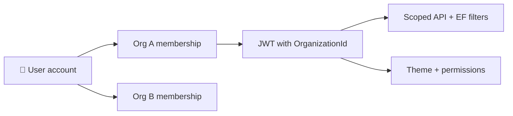

# 🏛️ Omada Platform

> **One platform. Many organizations. Your colors, your widgets, your world.**

Omada is a **multi-tenant SaaS** built for **universities and corporate organizations** — schedules, news, tasks, rooms, campus maps, directory, chat, grades, attendance, digital ID, and more in a single, beautifully themed experience.

Each user account can belong to **multiple organizations**. Switching orgs feels like switching **instances**: theme, branding, permissions, and data all follow the active organization.

---

## ✨ What makes Omada special

| Feature | Description |
|---------|-------------|
| 🎨 **Org theming** | Primary / secondary / tertiary colors from your logo — Claymorphism UI on mobile |
| 🧩 **Widget dashboard** | Bento grid home screen — enable features org-wide, control access per role |
| 🏢 **Multi-tenant** | JWT + EF global filters — data isolation by `OrganizationId` |
| 🔐 **Widget RBAC** | View → Edit → Admin per widget; SuperAdmin bypass |
| 🔗 **Invite system** | Unique invite code + link per org; email invites at registration |
| 🕷️ **Web spider** | Crawl public timetable & news pages into the platform |
| 🗺️ **Map & floorplans** | Roboflow AI extracts room geometry from floorplan images |
| ⚡ **Real-time** | SignalR for chat; React Query + offline-friendly patterns on mobile |
| 🔍 **Universal search** | Cross-widget search scoped to permissions |

---

## 🛠️ Tech stack

| Layer | Technologies |
|-------|--------------|
| **Backend** | ASP.NET Core (.NET 8), EF Core, SQL Server, NSwag, FluentValidation, SignalR, Hangfire, Serilog |
| **Mobile / web app** | React Native (Expo Router), React Query, Zustand, NSwag-generated Axios client |
| **AI / ingestion** | Roboflow (floorplan segmentation), Google Gemini (spider fallback), HtmlAgilityPack |
| **Optional** | Next.js 16 placeholder at `src/frontend/web` — **not** the main product UI |

---

## 📁 Repository structure

```text
omada-platform/
├── 📄 README.md                    ← You are here
├── 📚 docs/                        ← Full documentation hub
│   ├── README.md                   ← Start here for docs index
│   ├── Architecture.md             ← Big-picture system design
│   ├── Configuration.md            ← .env, appsettings, setup
│   ├── Backend.md                  ← API structure & features
│   ├── Frontend.md                 ← Mobile app structure & routes
│   └── WebSpider.md                ← Crawling & sync deep dive
│
├── ⚙️ src/backend/
│   ├── Omada.sln
│   └── Omada.Api/                  ← Main REST API (everything lives here)
│       ├── Controllers/            ← 23 HTTP controllers
│       ├── Services/               ← Business logic
│       ├── Entities/ + Data/       ← EF Core + migrations
│       ├── DTOs/ + Validators/     ← API contracts
│       ├── Infrastructure/         ← Auth, tenancy, Hangfire, middleware
│       └── Hubs/                   ← SignalR
│
└── 📱 src/frontend/
    ├── mobile/                     ← ⭐ Primary client (iOS, Android, Expo web)
    │   ├── src/app/                ← Expo Router (thin routes)
    │   ├── src/screens/            ← All feature UI
    │   ├── src/components/         ← Clay design system
    │   └── src/api/                ← NSwag generated client
    └── web/                        ← Optional Next.js placeholder
```

> 💡 **No separate Python service** — floorplan AI runs inside `Omada.Api`.

---

## 🚀 Quick start (local development)

Full setup guide: **[`docs/Configuration.md`](docs/Configuration.md)**

### Prerequisites

- ✅ .NET 8 SDK
- ✅ Node.js (LTS)
- ✅ SQL Server or LocalDB (Development uses LocalDB by default)
- ✅ Expo tooling (Android Studio / Xcode as needed)
- 🔑 Roboflow API key — only if you use **floorplan AI** in map admin

### 1️⃣ Backend API

```bash
cd src/backend/Omada.Api
copy .env.example .env
# Edit .env — set ROBOFLOW_API_KEY if using floorplan AI
dotnet restore
dotnet run
```

| Resource | URL |
|----------|-----|
| 📖 Swagger | `http://localhost:5069/swagger` |
| ⏰ Hangfire | `http://localhost:5069/hangfire` |

### 2️⃣ Mobile app

```bash
cd src/frontend/mobile
copy .env.example .env
# Set EXPO_PUBLIC_API_BASE_URL (LAN IP on physical device)
npm install
npm run start
```

Press **`w`** for Expo web · **`a`** for Android · **`i`** for iOS

### 3️⃣ Generate TypeScript API client

With the API running:

```bash
cd src/frontend/mobile
npm run generate-api
```

Reads Swagger → writes `src/api/generatedClient.ts` (never edit by hand).

---

## 🧠 Product model (high level)

### Organizations & tenancy



- **Organization** — tenant with theme, enabled widgets, invite code
- **User** — global account; can belong to many orgs
- **Active org** — drives theme, permissions, and API scoping
- **Invites** — share link/code or email invites; join via `POST /api/Auth/join`

### Widgets & permissions (two layers)

1. **Org widget catalog** — which features are enabled org-wide (`Organization.EnabledWidgetKeysJson`)
2. **Role permissions** — per-role **View → Edit → Admin** on enabled widgets only

Enforced with `[HasPermission]` on controllers. **SuperAdmin** bypasses widget checks and can enter any active org.

Examples: `schedule`, `news`, `map`, `rooms`, `chat`, `grades`, `admin`, `super-admin`

### Admin surfaces

| Role | Mobile route | API prefix |
|------|--------------|------------|
| 🏛️ Org admin | `/org-dashboard` + 13 workspaces | `/api/Organizations/current` |
| 🌐 Platform admin | `/admin-dashboard` | `/api/super-admin` |

---

## 📚 Documentation map

| Document | What's inside |
|----------|---------------|
| 📚 [`docs/README.md`](docs/README.md) | **Documentation hub** — index of all guides |
| 🏗️ [`docs/Architecture.md`](docs/Architecture.md) | System design, data flow, tenancy, permissions |
| ⚙️ [`docs/Backend.md`](docs/Backend.md) | API folders, 23 controllers, services, entities |
| 📱 [`docs/Frontend.md`](docs/Frontend.md) | Mobile routes, Clay UI, widgets, admin workspaces |
| 🔧 [`docs/Configuration.md`](docs/Configuration.md) | `.env`, appsettings, checklist for new clones |
| 🕷️ [`docs/WebSpider.md`](docs/WebSpider.md) | Timetable/news crawling, Hangfire, Gemini |
| 📱 [`src/frontend/mobile/TUTORIAL.md`](src/frontend/mobile/TUTORIAL.md) | End-user flows (registration, invites, daily use) |

---

## 🗺️ Floorplan processing (map admin)

| Step | Component |
|------|-----------|
| 📤 Upload image | `FloorplansController` + `FloorplanProcessingService` |
| 🤖 AI extraction | `RoboflowFloorplanGeoJsonExtractor` |
| 💾 Storage | `wwwroot/images/maps/floorplans/` + `Floorplan.GeoJsonData` |
| 🏠 Publish rooms | GeoJSON polygons → bookable `Room` rows |

Requires **`map` widget + Admin** for upload. Set **`ROBOFLOW_API_KEY`** in backend `.env`.

---

## 🕷️ Web spider (schedule & news)

Crawls public HTML for timetables and news. Org admins configure URLs in the **Web crawling** workspace.

| Resource | Link |
|----------|------|
| Deep dive | [`docs/WebSpider.md`](docs/WebSpider.md) |
| Admin UI | `/web-spider-workspace` |
| API | `/api/web-spider/*` (admin widget + Admin) |

---

## 📋 Development conventions

| Rule | Why |
|------|-----|
| **Vertical slices** | Entity → Service → Controller → DTO → Swagger → `generate-api` → hook → UI |
| **API envelopes** | Always `ServiceResponse<T>` + `AppError` |
| **Tenancy** | Never bypass org filters without explicit reason |
| **Secrets** | Only in `.env` / host config — never committed |
| **One API process** | Only one `Omada.Api` instance — stop stale processes if build locks |

---

## 🤝 Contributing mindset

Omada favors **clarity over cleverness**. Match existing patterns, keep files small, and regenerate the NSwag client after every API contract change.

**Happy building!** 🎉
