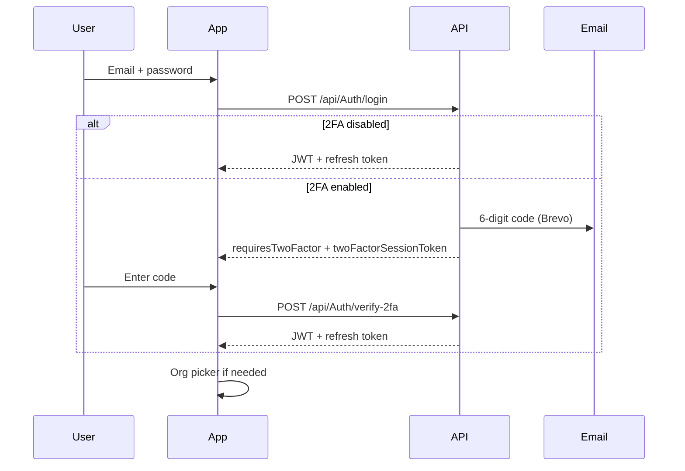

# Account security (password & 2FA)

> Password management, email-based reset, and **email OTP two-factor authentication** at sign-in.

**See also:** [`Configuration.md`](Configuration.md) (Brevo, `PublicAppUrl`) · [`Backend.md`](Backend.md) · [`Frontend.md`](Frontend.md) · [`Architecture.md`](Architecture.md)

---

## Overview

| Flow | Who | API | Mobile UI |
|------|-----|-----|-----------|
| **Change password** | Logged-in user | `POST /api/Users/me/change-password` | Settings → **Security** |
| **Forgot password** | Logged out | `POST /api/Auth/forgot-password` | `(auth)/forgot-password` |
| **Reset password** | Logged out (email link) | `POST /api/Auth/reset-password` | `(auth)/reset-password?email=&token=` |
| **2FA at sign-in** | Logged out | `POST /api/Auth/login` → `verify-2fa` / `resend-2fa` | Login → **Check your email** step |

**Password rules** (change, reset, registration): min **8** characters, at least **one uppercase** letter and **one digit** (`Validators/Auth/PasswordRules.cs`, mobile `utils/passwordValidation.ts`).

**Password fields:** use **`IconInput`** with a **separate visibility toggle per field** (Security: current / new / confirm; reset: new / confirm).

---

## Change password (authenticated)

1. User opens **Settings → Security** (member `(settings)/security` or admin `(admin)/admin-security`).
2. Enters **current password**, **new password**, **confirm**.
3. `UserService.ChangePasswordAsync`:
   - Verifies current password with BCrypt.
   - Hashes and saves new password.
   - Clears any pending password-reset / 2FA challenge fields.
   - **Revokes all refresh tokens** (other sessions must sign in again).

**Do not** use `POST /api/Auth/reset-password` for logged-in password changes — that endpoint is for **email reset links only**.

---

## Forgot & reset password (email link)

### Forgot

1. Sign-in screen → **Forgot Password?** → `(auth)/forgot-password`.
2. `AuthService.ForgotPasswordAsync`:
   - Case-insensitive email lookup.
   - Always returns generic success message (no email enumeration).
   - Generates token, sets `PasswordResetTokenPurpose = "reset"`, expiry **1 hour**.
   - Sends email via Brevo (`SendPasswordResetEmailAsync`).

### Reset link

Built by `IInviteLinkBuilder.BuildPasswordResetLink`:

```text
{AppConfig:PublicAppUrl}/reset-password?email={email}&token={token}
```

**Important:** On a physical device or LAN testing, set **`AppConfig__PublicAppUrl`** in backend `.env` to the **same host/port as Expo web** (e.g. `http://192.168.x.x:8081`), not `localhost`.

### Reset

1. User opens link → `(auth)/reset-password` reads `email` + `token` from query params.
2. `AuthService.ResetPasswordAsync`:
   - Rejects tokens with purpose **`invite`** (invite setup uses the same column family).
   - Accepts purpose **`reset`** or legacy **null** purpose.
   - Case-insensitive email + token match.
   - Updates password, clears reset fields, **revokes refresh tokens**.

---

## Email OTP two-factor authentication (2FA)

### Enable / disable

- **Settings → Security** → **Two-factor authentication** toggle.
- `PUT /api/Users/security` → `UserService.UpdateSecurityAsync` sets `User.IsTwoFactorEnabled`.
- Disabling 2FA clears any pending login challenge fields on the user.

### Sign-in flow



1. After valid password, if `IsTwoFactorEnabled`:
   - API does **not** issue JWT yet.
   - Stores `TwoFactorPendingSessionToken`, `TwoFactorCode` (6 digits), `TwoFactorCodeExpires` (**10 minutes**).
   - Returns `LoginResponse` with `requiresTwoFactor: true` and `twoFactorSessionToken`.
2. Mobile shows **`TwoFactorChallengePanel`** on the login screen (`useLoginLogic`).
3. User submits code → `POST /api/Auth/verify-2fa` → full `LoginResponse` with tokens.
4. **Resend:** `POST /api/Auth/resend-2fa` with the same session token → new code + extended expiry.

**Public auth routes** (no Bearer token): login, forgot/reset password, verify-2fa, resend-2fa — see `apiClient.ts` `isPublicAuthRequest`.

**Guard:** `useAuthNavigationGuard` allows `(auth)/forgot-password` and `(auth)/reset-password` while logged in (password recovery without redirect to dashboard).

---

## Backend reference

### Auth endpoints

| Method | Route | Auth | Purpose |
|--------|-------|------|---------|
| POST | `/api/Auth/login` | Public | Password check; JWT **or** 2FA challenge |
| POST | `/api/Auth/verify-2fa` | Public | Complete login after email code |
| POST | `/api/Auth/resend-2fa` | Public | New 6-digit code for pending session |
| POST | `/api/Auth/forgot-password` | Public | Start reset email |
| POST | `/api/Auth/reset-password` | Public | Complete reset from email link |

### Users endpoints

| Method | Route | Auth | Purpose |
|--------|-------|------|---------|
| PUT | `/api/Users/security` | Bearer | Toggle `isTwoFactorEnabled` |
| POST | `/api/Users/me/change-password` | Bearer | Change password (current + new) |
| POST | `/api/Users/me/export` | Bearer | GDPR JSON export |
| DELETE | `/api/Users/me` | Bearer | Soft-delete / anonymize account |

### User entity fields (security-related)

| Field | Purpose |
|-------|---------|
| `PasswordResetToken` / `PasswordResetTokenExpires` | Email reset **or** invite setup token |
| `PasswordResetTokenPurpose` | `"invite"` \| `"reset"` — prevents cross-flow token reuse |
| `TwoFactorPendingSessionToken` | Opaque session id returned to client during 2FA login |
| `TwoFactorCode` / `TwoFactorCodeExpires` | 6-digit OTP and expiry |
| `IsTwoFactorEnabled` | Profile flag; enforced at login |

Constants: `Infrastructure/Constants/PasswordResetTokenPurposes.cs`, `TwoFactorConstants.cs`.

### Email templates

`Infrastructure/InviteEmailTemplates.cs`: `PasswordReset`, `TwoFactorSignInCode` (+ existing invite templates).

Without Brevo config, bodies are **logged to the API console** (same as invites).

---

## Frontend reference

### Routes (`app/(auth)/`)

| Route | Screen |
|-------|--------|
| `login-flow/` | Login + org picker + **2FA challenge** |
| `forgot-password` | Request reset email |
| `reset-password` | New password from email link |

### Hooks & files

| Path | Role |
|------|------|
| `screens/auth/login/hooks/useLoginLogic.ts` | Login, 2FA verify/resend, org selection |
| `screens/auth/login/components/TwoFactorChallengePanel.tsx` | 6-digit code UI |
| `screens/auth/forgot-password/` | Forgot flow |
| `screens/auth/reset-password/` | Reset flow |
| `screens/widgets/security/hooks/useSecurityLogic.ts` | Change password, 2FA toggle, export, delete |
| `screens/widgets/security/components/SecurityScreen.tsx` | Security UI (no device biometrics on this screen) |

### NSwag

After API contract changes:

```bash
cd src/frontend/mobile
npm run generate-api
```

Clients: `authApi.login`, `verifyTwoFactor`, `resendTwoFactor`, `forgotPassword`, `resetPassword`; `usersApi.changePassword`, `updateSecurity`.

---

## Configuration checklist

| Setting | Used for |
|---------|----------|
| `BREVO_API_KEY`, `BREVO_SENDER_EMAIL` | Reset emails, 2FA codes, invites |
| `AppConfig__PublicAppUrl` | Reset password links (must match Expo URL on device) |
| `AppConfig__BaseUrl` | API / media URLs |
| `EXPO_PUBLIC_API_BASE_URL` | Mobile → API (LAN IP on phone) |

Migrations (applied on API startup via `Program.cs` → `MigrateAsync`):

- `AddPasswordResetTokenPurpose`
- `AddTwoFactorLoginChallenge`

`dotnet ef database update` reporting **“already up to date”** means migrations were already applied (often at API startup).
