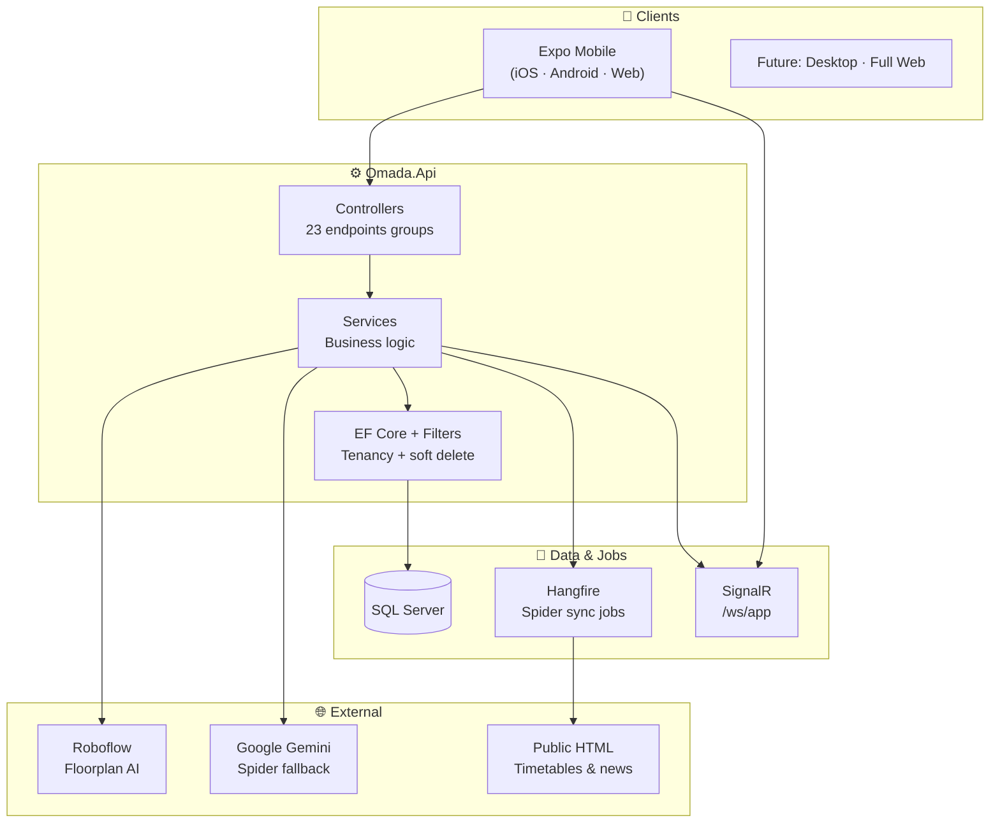
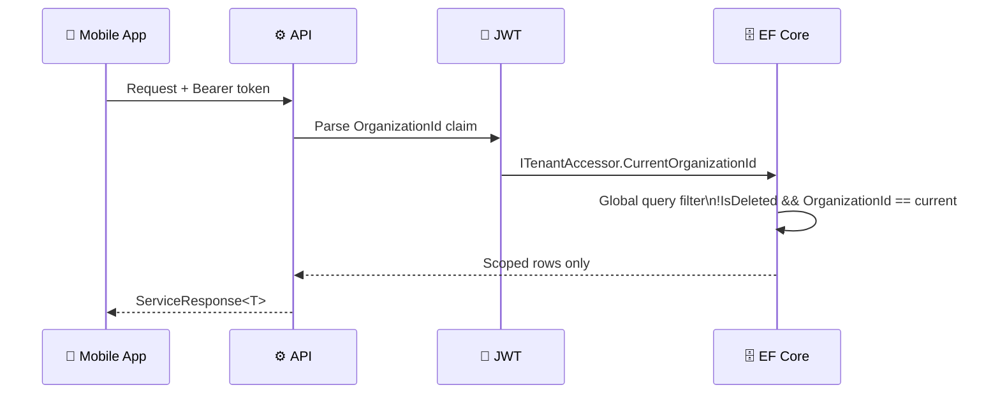
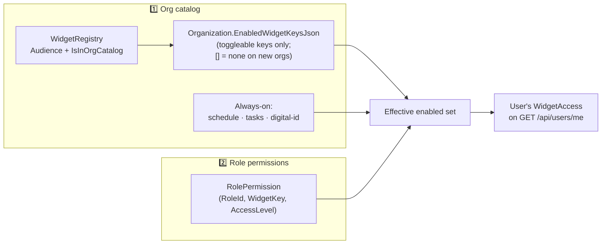
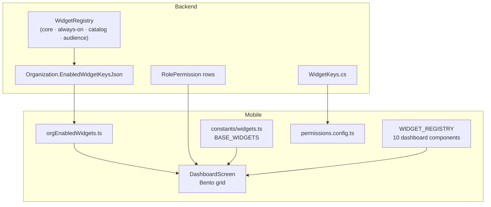

# 🏗️ Omada Architecture

A visual, practical guide to how Omada is designed — from login to database rows to dashboard widgets.

**Related:** [`Backend.md`](Backend.md) · [`Frontend.md`](Frontend.md) · [`Configuration.md`](Configuration.md) · [`AccountSecurity.md`](AccountSecurity.md) · [`DigitalId.md`](DigitalId.md) · [`Timetables.md`](Timetables.md)

---

## 🎯 What Omada is

Omada is a **multi-tenant SaaS platform** for universities and organizations. One codebase serves many tenants (organizations), each with its own branding, enabled features, roles, and data.



---

## 🏢 Multi-tenancy model

### Accounts vs organizations

| Entity | Scope | Notes |
|--------|-------|-------|
| **User** | Global | One email/password; can join many orgs |
| **Organization** | Tenant | Theme, widgets, invite code, spider URLs |
| **OrganizationMember** | Link | User + Role within one org |
| **Active org** | Session | Stored in JWT `OrganizationId` claim |

### How tenancy is enforced



| Abstraction | When | Behavior |
|-------------|------|----------|
| `ITenantAccessor` | EF filters, seed, migrations | Returns `OrganizationId` or **null** (no org filter) |
| `IUserContext` | Services in `[Authorize]` flows | **Throws** if user/org claims missing |

**Excluded from org filters:** `Organization`, `User`, `OrganizationMember`, `RefreshToken` — cross-org membership needs unfiltered access.

---

## 🔐 Authentication & authorization

### Authentication (JWT)

```text
Login → Access token (short) + Refresh token (stored in DB)
         │
         ├── Claims: userId, email, OrganizationId, Role
         │
         └── Refresh → new access token (rotation)
```

- **Password hashing:** BCrypt
- **Org switch:** `POST /api/Auth/switch-org` → new JWT with different `OrganizationId`
- **SuperAdmin:** can enter any **active** org without membership
- **Forgot / reset password:** email link flow — [`AccountSecurity.md`](AccountSecurity.md)
- **Email OTP 2FA:** when enabled on profile, login returns `requiresTwoFactor` + session token until `verify-2fa` succeeds

```text
Login (password OK)
  ├── 2FA off → JWT + refresh
  └── 2FA on  → email 6-digit code → verify-2fa → JWT + refresh

Change password (logged in) → POST /api/Users/me/change-password (revokes refresh tokens)
Forgot password → email link → POST /api/Auth/reset-password
```

### Authorization (widget RBAC)

Two independent layers:



- **Org type** filters catalog options: university (grades) vs corporate (documents) vs shared (**announcements**, map, rooms, …). **Coursework** uses always-on **`tasks`** (roles UI: **Tasks**) — see [`Coursework.md`](Coursework.md). **Grades widget** — coursework standing + teacher gradebook — see [`Grades.md`](Grades.md). **Announcements** — replaces chat/news — see [`Announcements.md`](Announcements.md).
- **Removed** from member catalog: events, transport, finance. **Groups** = admin RBAC only.

| Access level | Can do |
|--------------|--------|
| **View** | Read data |
| **Edit** | Create/update (includes View) |
| **Admin** | Full control (includes Edit + View) |

- Policy format: `widgetKey:AccessLevel` (e.g. `news:View`)
- **SuperAdmin** role bypasses all widget checks
- Frontend mirrors via `permissions.config.ts` → `PermissionContext.can()`
- **Org admin console access (mobile):** **Admin** / **SuperAdmin** role, or **`admin`** widget **Admin** on `GET /api/users/me` → **`canAccessOrgAdminConsole`**; profile toggles switch between admin console and member app (`OrgAdminExperienceContext`)

**Holding roles (org admin)**

When an org admin deletes a custom role, members are moved to a **holding role** — not another custom role:

1. Existing **`Unassigned`** role, else **`Member`**, else auto-create **`Unassigned`**
2. Deleting **`Unassigned`** uses **`Member`** (create if missing)
3. Admins reassign people from **Members** (filter by holding role) to proper roles

Logic: **`RoleResolution`** + **`OrganizationAdminService.DeleteRoleAsync`**. Names in **`RoleNames`**.

---

## 📦 Backend layers (N-tier)

```text
┌─────────────────────────────────────────┐
│  Controllers/          ← HTTP, thin      │
│  [HasPermission]       ← Authz attrs     │
├─────────────────────────────────────────┤
│  Services/             ← Business logic  │
│  IUserContext          ← Current user    │
├─────────────────────────────────────────┤
│  Repositories/ + UoW   ← Data access     │
│  ApplicationDbContext  ← EF + filters    │
├─────────────────────────────────────────┤
│  Entities/             ← Domain models   │
│  Data/Configurations/  ← Fluent API      │
└─────────────────────────────────────────┘
         ↕ DTOs + Validators at HTTP boundary
```

### Standard API response

Every endpoint returns **`ServiceResponse<T>`**:

```json
{
  "isSuccess": true,
  "data": { ... },
  "error": null
}
```

Errors use **`AppError`** with codes like `AUTH_001`, `DATA_404`. Controllers don't use broad try/catch — **`ExceptionHandlingMiddleware`** handles failures.

---

## 📱 Frontend architecture

### Expo Router + smart/dumb split

```text
app/(app)/(widgets)/news.tsx     ← Thin route (5 lines)
        │
        ▼
screens/widgets/news/            ← Feature folder
  ├── components/                ← Presentational UI
  ├── hooks/                     ← React Query, handlers
  └── styles/                    ← StyleSheets
```

### Provider stack (root `_layout.tsx`)

| Provider | Responsibility |
|----------|------------------|
| `AuthContext` | JWT, login, logout, org switch |
| `CurrentOrganizationContext` | Active org + cache |
| `OrganizationThemeContext` | Org colors → navigation theme |
| `PermissionContext` | `can(capability)` from `/api/users/me` |
| `QueryClientProvider` | React Query + AsyncStorage persist |

### Clay design system

Product UI uses **Claymorphism** primitives — not raw React Native chrome:

- `ClayView`, `AppText`, `AppButton`, `ClayPress`
- Colors from `useThemeColors()` (org primary/secondary/tertiary)
- Animations from `constants/animations.ts`

---

## 🧩 Widget system (end-to-end)



**Dashboard widgets (9):** `announcements`, `schedule`, `tasks`, `map`, `users`, `attendance`, `grades`, `rooms` — university **coursework** is under always-on **`tasks`**, not a separate catalog widget. Legacy **`news`** / **`chat`** bento keys map to **`announcements`**.

**Admin catalog:** toggleable per org type; **always on:** schedule, tasks, digital-id. **Not in catalog:** events, transport, finance. **Groups:** admin permissions only.

---

## 🗄️ Major data domains

| Domain | Key entities | API surface |
|--------|--------------|-------------|
| 🏢 Tenancy | `Organization`, `User`, `OrganizationMember`, `Role` | Auth, Orgs, Users |
| 📅 Schedule | `Event`, `EventType`, `CourseOffering.WeeklySessionPlanJson`, `ScrapedClassEvent` | Schedule, EventTypes, **PeriodTimetableAdmin**, WebSpider |
| 📰 Content | `NewsItem`, `TaskItem`, `Grade`, `Message`, **`AnnouncementChannel`**, **`AnnouncementPost`**, **`AnnouncementComment`** | News (legacy), Tasks, Grades, Chat (legacy), **Announcements** |
| 🗺️ Map | `Building`, `Floor`, `Room`, `Floorplan`, `MapPin` | Buildings, Maps, Floorplans, Rooms |

**Map coordinates:** campus **`Building.Latitude/Longitude`** (outdoor markers) vs indoor **`Room.CoordinateX/Y`** normalized on floorplan images. Admin: **`/floorplan-workspace`** (Locations & maps) — levels may exist without floorplan; optional Roboflow AI. See **`domain-map-rooms-admin.mdc`**.
| 🕷️ Spider | `ScrapedClassEvent`, `SpiderSyncRun` | WebSpider |
| 📋 Admin | `AuditLog`, `OrganizationPeriod` | OrgAdmin, SuperAdmin |

> ⚠️ **Important:** In-app calendar (`Event`) and scraped timetable (`ScrapedClassEvent`) are **separate models**. Optional spider **sync** fills `ScrapedClassEvent` via Hangfire. **Import map & apply** writes **`WeeklySessionPlanJson`** on offerings (`ScrapedScheduleApplyService`) — members still need **native publish** (`OfferingTimetableService`) for Schedule. See [`Timetables.md`](Timetables.md) · [`WebSpider.md`](WebSpider.md).

---

## 🔄 Vertical slice workflow

The recommended way to ship a feature:

```text
1. 📝 Entity + EF Configuration
2. 📋 DTOs + FluentValidation
3. ⚙️ Service + Interface → register in Program.cs
4. 🌐 Controller + [HasPermission]
5. 🗄️ EF Migration (if schema changed)
6. 📖 Confirm Swagger
7. 🔄 npm run generate-api
8. 🪝 React Query hook
9. 🎨 Screen + Clay components
10. 🧩 Register widget (if dashboard feature)
```

---

## ⚡ Background jobs & real-time

| System | Purpose | Entry point |
|--------|---------|-------------|
| **Hangfire** | Spider schedule/news sync | `ScheduleSyncJobs` |
| **SignalR** | Chat notifications | `AppHub` at `/ws/app` |
| **Serilog** | Structured logging | Console + rolling file |

Hangfire dashboard: `http://localhost:5069/hangfire` (secure in production).

---

## 🌐 External integrations

| Service | Used for | Config |
|---------|----------|--------|
| **Roboflow** | Floorplan room segmentation → GeoJSON | `ROBOFLOW_API_KEY` in `.env` |
| **Google Gemini** | Spider parse fallback, news categorization | `GEMINI_API_KEY` in `.env` |
| **Public websites** | Timetable & news HTML | URLs on `Organization` record |

---

## 📂 Monorepo map

```text
omada-platform/
├── docs/                    ← Documentation (you are here)
├── src/backend/Omada.Api/   ← Single API project (~444 source files)
└── src/frontend/
    ├── mobile/              ← Primary client (~508 source files)
    └── web/                 ← Next.js placeholder (11 files)
```

---

## 🎓 Design principles

| Principle | Implementation |
|-----------|----------------|
| **Tenant isolation** | EF global filters + JWT claims |
| **Consistent API shape** | `ServiceResponse<T>` everywhere |
| **Permission granularity** | Widget-level View/Edit/Admin |
| **Org theming** | Branding on org → mobile Clay colors |
| **NSwag-first** | Backend DTOs drive TypeScript client |
| **Thin routes** | Expo Router imports from `screens/` |

---

## 📚 Next steps

| Topic | Document |
|-------|----------|
| API folders & controllers | [`Backend.md`](Backend.md) |
| Mobile routes & components | [`Frontend.md`](Frontend.md) |
| Environment setup | [`Configuration.md`](Configuration.md) |
| Native timetables | [`Timetables.md`](Timetables.md) |
| Web crawling | [`WebSpider.md`](WebSpider.md) |
