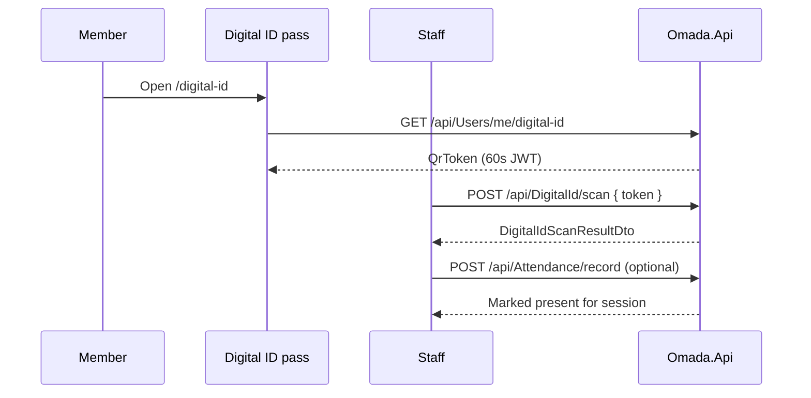

# 🪪 Digital ID

Organization-scoped member pass with a **rotating QR code** (primary), optional **1D barcode** (secondary), and an in-app **staff scanner** for verification and attendance.

---

## Product behavior

| Decision | Detail |
|----------|--------|
| **QR priority** | Large QR on the pass; barcode in a bottom sheet (“Show member barcode”) |
| **Org branding** | Pass uses org **logo**, **short name**, and **primary / secondary / tertiary** colors |
| **Widget tier** | **Always on** — merged with schedule and tasks; not toggleable in `/widgets-workspace` |
| **Member entry** | **Profile menu row only** — no dashboard thumbnail / bento tile |
| **Staff scanner** | In-app camera (native) or paste / `BarcodeDetector` (web) |
| **Attendance** | After a valid scan, staff can **mark present** for a selected session **or** use **manual roll** (directory search) |
| **Org scope** | Pass and scan results are for the **active organization** only |
| **Mobile UX** | Screen brightness raised while pass is focused (`useBrightnessWhileFocused`); screenshot warning on pass screen |

---

## Backend API

| Method | Route | Auth | Permission / notes |
|--------|-------|------|-------------------|
| `GET` | `/api/Users/me/digital-id` | Bearer | `digital-id` **View** — card payload + rotating `QrToken` |
| `POST` | `/api/DigitalId/validate` | Optional `X-Scanner-Key` | **Anonymous** — external / kiosk scanners; not org JWT |
| `POST` | `/api/DigitalId/scan` | Bearer | `attendance` **Edit** **or** `digital-id` **Edit** — in-app staff scan |
| `POST` | `/api/Attendance/record` | Bearer | `attendance` **Edit** — manual roll or post-scan mark present |

### `DigitalIdDto` (pass payload)

Includes: `fullName`, `roleName`, `organizationName`, `organizationShortName`, `organizationLogoUrl`, `organizationId`, `primaryColor`, `secondaryColor`, `tertiaryColor`, `avatarUrl`, `qrExpiresAtUtc`, `qrToken`, `barcodeValue`.

### `DigitalIdScanResultDto` (staff scan)

`valid`, optional `userId`, `organizationId`, `fullName`, `roleName`, `avatarUrl`, `message`.

### Options (`DigitalId` in `appsettings`)

| Key | Default | Purpose |
|-----|---------|---------|
| `TokenLifetimeSeconds` | `60` | Rotating QR JWT lifetime |
| `QrAudience` | `https://omada.app/digital-id-qr` | Separate from login JWT audience |
| `ScannerApiKey` | empty | When set, `POST .../validate` requires header `X-Scanner-Key` |

**Services:** `DigitalIdService` (pass + validate + scan), `AttendanceService.RecordMemberAttendanceAsync` (staff records another member), `ScheduleService.ApplyAttendanceForUserAsync` (shared attendance apply).

---

## Mobile routes & entry points

| Route | Screen | Who |
|-------|--------|-----|
| `/digital-id` | `DigitalIdScreen` | Members — profile → **Digital ID** |
| `/digital-id-scanner` | `DigitalIdScannerScreen` | Staff with `attendance.take` or `digital-id.manage` |
| `/admin-digital-id` | `DigitalIdScreen` (`adminConsole`) | Org admin account menu |
| `/admin-digital-id-scanner` | `DigitalIdScannerScreen` (`adminConsole`) | Staff from admin Digital ID pass |

**Scanner entry (no header Scan button on pass):**

- Pass → **How to use** card → **Open scanner** (when permitted)
- Attendance widget → teacher view → **Scan Digital ID**

**Permissions (capabilities):**

- `digital-id.view` — open pass
- `digital-id.manage` — open scanner (with `attendance.take`)
- `attendance.take` — scanner + mark present / manual roll

---

## Frontend structure (`screens/widgets/digital-id/`)

```text
components/
  DigitalIdScreen.tsx          Pass screen (wide web: pass + how-to side-by-side)
  DigitalIdPassCard.tsx        Wallet-style pass (QR, countdown, org colors)
  DigitalIdHowToUseCard.tsx    Title outside ClayView; body + Open scanner
  DigitalIdScannerScreen.tsx   Session picker, verify result, manual roll
  DigitalIdScannerCamera.tsx   Native — expo-camera
  DigitalIdScannerCamera.web.tsx  Web — BarcodeDetector or paste fallback
  DigitalIdManualRollPanel.tsx Directory search + mark present
  DigitalIdClaySection.tsx     Shared Clay section pattern + inset constants
hooks/
  useDigitalIdLogic.ts         GET pass + smart QR refetch interval
  useDigitalIdScannerLogic.ts  Scan, sessions, record attendance
  useBrightnessWhileFocused.ts Max brightness on pass (native)
  useScreenshotWarning.ts      Warn on screenshot (pass)
```

**API wiring:** `usersApi.getMyDigitalId()`, `digitalIdApi.scan()`, `attendanceApi.recordMemberAttendance()` via NSwag (`npm run generate-api` after contract changes).

**Native dependency:** `expo-camera` (plugin in `app.json`) — rebuild native apps after adding.

---

## Clay UI pattern (text-heavy cards)

`ClayView` **`puffy` does not add padding** — it only affects highlight/shadow strength. Body text flush against the inner stroke gets **clipped at rounded corners** (especially on web).

**Use this pattern** for Digital ID sections and any similar text-only Clay cards:

1. Put **section titles outside** `ClayView` (`DigitalIdClaySection` uses `caption` label; How to use uses `h3` above the card).
2. On inner `ClayView`: `contentOverflow="visible"`, `contentFlexGrow={0}`, moderate `borderRadius` (**16**).
3. Apply explicit inset via style: **`DIGITAL_ID_CLAY_INSET`** (`paddingHorizontal: 20`, `paddingVertical: 18`) from `DigitalIdClaySection.tsx`.
4. Prefer **`DigitalIdClaySection`** for scanner blocks (Session, Verify code, Manual roll) instead of duplicating props.

Do **not** rely on `puffy={18}` alone for content spacing.

---

## Flow (staff scan + attendance)



Staff may skip attendance recording and verify only. **Manual roll** searches the directory and calls the same `record` endpoint without a scan.

---

## Related documentation

| Doc | Topic |
|-----|-------|
| [`Backend.md`](Backend.md) | Controllers & services map |
| [`Frontend.md`](Frontend.md) | Expo routes & widget layout |
| [`Configuration.md`](Configuration.md) | `DigitalId` appsettings |
| [`.cursor/rules/domain-digital-id.mdc`](../.cursor/rules/domain-digital-id.mdc) | Scoped agent rules for this feature |
