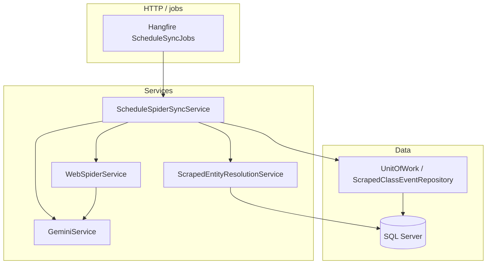

# Omada Web Spider — Documentation

This document describes the **Web Spider** subsystem in `src/backend/Omada.Api/`: crawling HTML pages, extracting **timetable rows** and **news articles**, **merging** them into the database with hash-based change detection, **entity resolution** (host + room), **Google Gemini** for NLP (news triage, schedule fallback), and **Hangfire** background jobs.

---

## 1. Purpose

| Capability | Role |
|------------|------|
| **Schedule discovery** | Breadth-first crawl of same-host links; classify pages as **menu** vs **schedule** (HTML table heuristics). |
| **Schedule extraction** | Parse timetable-like `<table>` grids (rowspan/colspan) into `ScrapedEventDto`. If the DOM no longer matches, **self-heal** via Gemini JSON extraction from plain text. |
| **News discovery** | Crawl with news-oriented heuristics (paths, `<article>`, archives). |
| **News extraction** | Strip boilerplate, extract title + body; optional **Gemini** `NewsCategory` triage. |
| **Persistence & merge** | Hangfire job loads org schedule URL → extract rows → **upsert** `ScrapedClassEvent` by natural key + **SHA-256 hash**; resolve **HostId** / **RoomId** in batch + cache. |

The in-app calendar entity is **`Event`**. Persisted spider timetable snapshots live in **`ScrapedClassEvent`** (separate table).

---

## 2. High-level architecture



- **`WebSpiderService`**: HTTP fetch (via injected `HttpClient`), HTML parsing (HtmlAgilityPack), discovery + extraction.
- **`scheduleSpiderSyncService`**: orchestrates URL config → HTML → `ExtractScheduleFromTableAsync` → resolution maps → upsert `ScrapedClassEvent`.
- **`GeminiService`**: Google Generative Language API (`generateContent`) for categories and schedule JSON fallback.
- **`ScrapedEntityResolutionService`**: batched org users + rooms + fuzzy match; `IMemoryCache` per org.

---

## 3. File inventory

### 3.1 Core service & contract

| File | Purpose |
|------|---------|
| `Services/WebSpiderService.cs` | Main implementation: BFS crawls, `ClassifyPage` / `ClassifyNewsPage`, table grid parsing, `ExtractScheduleFromTableAsync` (HAP + Gemini fallback), `ExtractNewsArticleAsync`, HTML strip helpers. |
| `Services/Interfaces/IWebSpiderService.cs` | Public API surface for the spider (see §5). |

### 3.2 Gemini (shared by spider + news)

| File | Purpose |
|------|---------|
| `Services/GeminiService.cs` | `CategorizeNewsExcerptAsync`, `ExtractScheduleFromRawTextAsync` (JSON array → `ScrapedEventDto`), HTTP POST to `generativelanguage.googleapis.com/v1beta/models/{model}:generateContent`. |
| `Services/Interfaces/IGeminiService.cs` | Interface for Gemini operations. |

### 3.3 Schedule merge / Hangfire

| File | Purpose |
|------|---------|
| `Services/ScheduleSpiderSyncService.cs` | `SyncScheduleDatabaseAsync`: fetch HTML, parse schedule, build resolution maps, hash upsert, `ScrapedClassEvent` CRUD. |
| `Services/Interfaces/IScheduleSpiderSyncService.cs` | Contract for merge job. |
| `Infrastructure/Hangfire/ScheduleSyncJobs.cs` | Hangfire entry point: `SyncScheduleDatabaseAsync(Guid organizationId)` with `[AutomaticRetry(Attempts = 3)]`, resolves scoped `IScheduleSpiderSyncService`. |
| `Infrastructure/Hangfire/HangfireDashboardNoAuthFilter.cs` | Dashboard auth filter (currently allows all — **lock down in production**). |

### 3.4 Entity resolution (batch + cache)

| File | Purpose |
|------|---------|
| `Services/ScrapedEntityResolutionService.cs` | Loads org members (+ role) and rooms once (cached); fuzzy-matches professor string → `HostId`, room text → `RoomId`; returns `ScrapedEventResolutionMaps`. |
| `Services/Interfaces/IScrapedEntityResolutionService.cs` | Contract. |
| `DTOs/Scraping/ScrapedEventResolutionMaps.cs` | `HostByProfessorKey` + `RoomByRoomTextKey` dictionaries. |

### 3.5 Hashing & exceptions

| File | Purpose |
|------|---------|
| `Infrastructure/Scraping/ScrapedEventHasher.cs` | `CalculateHash(ScrapedEventDto)` — SHA-256 over normalized timetable fields for change detection. |
| `Infrastructure/Scraping/HtmlStructureChangedException.cs` | Thrown when the table parser cannot produce rows or HAP throws; triggers **Gemini schedule fallback** in `WebSpiderService`. |

### 3.6 DTOs (`DTOs/Scraping/`)

| File | Purpose |
|------|---------|
| `ScrapedEventDto.cs` | One timetable row: `ClassName`, `Time`, `Room`, `Professor`, `GroupNumber`. |
| `SpiderDiscoveryResult.cs` | Wrapper: `StartUrl` + list of `DiscoveredPageDto`. |
| `DiscoveredPageDto.cs` | `Url` + `Kind` (`SpiderPageKind`). |
| `SpiderPageKind.cs` | Enum: e.g. schedule vs menu vs unknown (see code). |
| `NewsDiscoveryResult.cs` | Wrapper for news crawl: `StartUrl` + `DiscoveredNewsPageDto` list. |
| `DiscoveredNewsPageDto.cs` | `Url` + `NewsPageKind`. |
| `NewsPageKind.cs` | Article / archive / unknown. |
| `ExtractedNewsArticleDto.cs` | `Title`, `Content`, `Category` (`NewsCategory`) for news pipeline. |

### 3.7 Persistence (entities & EF)

| File | Purpose |
|------|---------|
| `Entities/ScrapedClassEvent.cs` | Org-scoped row: raw text fields + `DataHash`, `IsChanged`, `HostId`, `RoomId` (resolved FKs), FKs to `User`/`Room`. |
| `Data/Configurations/ScrapedClassEventConfiguration.cs` | Table `ScrapedClassEvents`, column `Room` maps to property `RoomText`, indexes, FKs. |
| `Repositories/ScrapedClassEventRepository.cs` | Repository implementation. |
| `Repositories/Interfaces/IScrapedClassEventRepository.cs` | Repository contract. |
| `Data/ApplicationDbContext.cs` | `DbSet<ScrapedClassEvent>`, global filters for tenancy + soft delete. |

### 3.8 Related enums

| File | Purpose |
|------|---------|
| `Entities/Enums.cs` | `NewsCategory` (triage labels), `NewsType` (announcement types), etc. |

### 3.9 App bootstrap & config

| File | Purpose |
|------|---------|
| `Program.cs` | Registers `HttpClient` for `IWebSpiderService` and `IGeminiService`, Hangfire SQL storage + server, `IScheduleSpiderSyncService`, `IScrapedEntityResolutionService`, `ScheduleSyncJobs`, `UseHangfireDashboard("/hangfire", ...)`. |
| `appsettings.json` | `Spider:DefaultSchedulePageUrl`, `Spider:Organizations:{guid}:SchedulePageUrl`, `Gemini:ApiKey`, `Gemini:Model`. |

### 3.10 Migrations (schema history)

| Migration (examples) | Purpose |
|----------------------|---------|
| `*AddScrapedClassEvents*` | Creates `ScrapedClassEvents` table. |
| `*EventResolutionAndTeacherFk*` / `*RestoreHostIdColumns*` | FKs for events/ scraped rows; column naming. |
| `*AddNewsCategoryToNews*` | `News.Category` for news triage. |

---

## 4. Dependency injection (Program.cs)

- **`AddHttpClient<IWebSpiderService, WebSpiderService>`** — timeout 45s, custom `User-Agent`.
- **`AddHttpClient<IGeminiService, GeminiService>`** — timeout 45s.
- **`AddScoped<IScheduleSpiderSyncService, ScheduleSpiderSyncService>`**
- **`AddScoped<IScrapedEntityResolutionService, ScrapedEntityResolutionService>`**
- **`AddSingleton<ScheduleSyncJobs>`**
- **`AddScoped<IScrapedClassEventRepository, ScrapedClassEventRepository>`** (with other repos)
- **`AddMemoryCache`** — used by resolution cache.
- **Hangfire**: `AddHangfire` + SQL Server storage + `AddHangfireServer`; dashboard at `/hangfire`.

Enqueue example:

```csharp
BackgroundJob.Enqueue<ScheduleSyncJobs>(j => j.SyncScheduleDatabaseAsync(organizationId));
```

---

## 5. `IWebSpiderService` — API summary

| Method | Behavior |
|--------|----------|
| `DiscoverLinksAsync(startUrl)` | BFS same-host links, classify each page (`SpiderPageKind`), cap ~250 pages. |
| `FetchSchedulePageHtmlAsync(url)` | GET HTML for schedule (used by sync). |
| `ExtractScheduleFromTableAsync(html)` | **Primary:** HtmlAgilityPack finds schedule-like table, builds grid, maps columns → `List<ScrapedEventDto>`. **If** no table / empty grid / zero rows / HAP throws → `HtmlStructureChangedException` → **fallback:** strip HTML to text, `IGeminiService.ExtractScheduleFromRawTextAsync`, deserialize JSON array. Logs **GEMINI AI FALLBACK TRIGGERED** when fallback runs. |
| `DiscoverNewsLinksAsync(startUrl)` | News-oriented BFS, cap ~200 pages, `NewsPageKind` per URL. |
| `ExtractNewsArticleAsync(html)` | Title + body extraction; calls Gemini for `NewsCategory` when API key present; `try/catch` so scraper stays up if Gemini fails. |

---

## 6. Schedule merge pipeline (`ScheduleSpiderSyncService`)

1. **Resolve URL** — `Spider:Organizations:{organizationId}:SchedulePageUrl` or `Spider:DefaultSchedulePageUrl`.
2. **Fetch** — `FetchSchedulePageHtmlAsync`.
3. **Extract** — `ExtractScheduleFromTableAsync` → `IReadOnlyList<ScrapedEventDto>`.
4. **Hash** — `ScrapedEventHasher.CalculateHash(dto)` per row.
5. **Natural key** — `ClassName` + `Time` + `GroupNumber` (normalized whitespace, case-insensitive).
6. **Resolution** — `IScrapedEntityResolutionService.BuildMapsAsync` → assign `HostId` / `RoomId` on `ScrapedClassEvent`.
7. **Upsert** — new rows → insert; same key + different hash → update fields, `IsChanged = true`; same hash → optionally clear `IsChanged` or refresh FK-only; keys missing from scrape → **delete** row.
8. **`SaveChanges`** — `IUnitOfWork.CompleteAsync`.

**Tenancy:** Hangfire runs without HTTP user; queries use explicit `OrganizationId` filters.

---

## 7. Gemini behavior

### 7.1 News categorization

- Prompt lists all `NewsCategory` values (university + corporate).
- Response: single label string; parsed with case-insensitive / fuzzy helpers.
- Missing key → `General`.

### 7.2 Schedule fallback (JSON)

- Prompt requires **only** a JSON **array** of objects with **`ClassName`, `Time`, `Room`, `Professor`, `GroupNumber`** (strings).
- **No** markdown fences; `NormalizeJsonArrayPayload` strips accidental ``` blocks.
- Deserializes to `List<ScrapedEventDto>` with case-insensitive property names.
- Failure → empty list (sync may then remove prior rows or do nothing).

**Configuration:** `Gemini:ApiKey`, `Gemini:Model` (default e.g. `gemini-2.0-flash`).

---

## 8. Configuration reference

```json
{
  "Spider": {
    "DefaultSchedulePageUrl": "https://example.edu/orar",
    "Organizations": {
      "00000000-0000-0000-0000-000000000001": {
        "SchedulePageUrl": "https://org-specific/orar"
      }
    }
  },
  "Gemini": {
    "ApiKey": "",
    "Model": "gemini-2.0-flash"
  }
}
```

Use **User Secrets** or environment variables for `Gemini:ApiKey` in development/production.

---

## 9. Operational notes

- **Hangfire dashboard** — `/hangfire` (secure in production).
- **SQL Server** — Hangfire schema created automatically with storage.
- **NSwag / mobile** — Regenerate API clients if DTOs or endpoints change.
- **Rate limits** — Crawl caps and HTTP timeouts limit load on target sites.

---

## 10. Change log (feature areas)

This subsystem evolved as: **ScrapedClassEvent** storage → **Hangfire** sync → **hash merge** → **HostId/RoomId resolution** + **IMemoryCache** → **Gemini** news triage + **`NewsCategory`** → **Gemini** schedule JSON fallback + **`HtmlStructureChangedException`** → **`ExtractScheduleFromTableAsync`**.

---

*Generated for the Omada Platform backend (`Omada.Api`). Update this file when adding new spider endpoints, DTOs, or behavior.*
