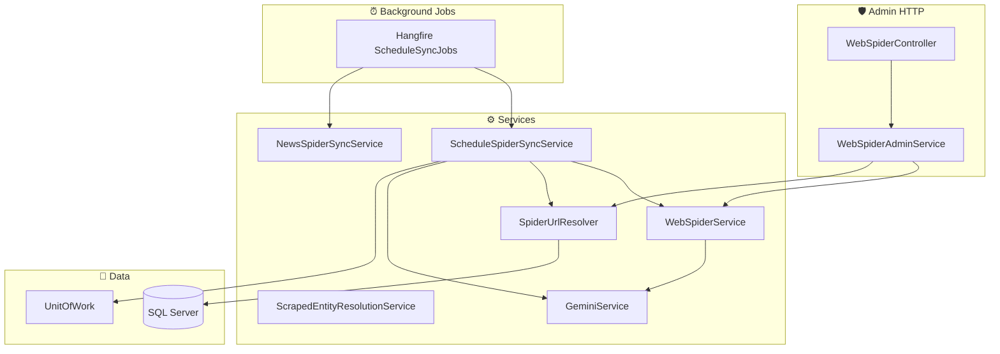

# 🕷️ Omada Web Spider

> Crawl public HTML, extract **timetable rows** and **news articles**, merge into the database, and manage everything from the mobile admin workspace.

**Related:** [`Configuration.md`](Configuration.md) · [`Backend.md`](Backend.md) · [`Architecture.md`](Architecture.md)

---

## 🎯 Purpose

| Capability | What it does |
|------------|--------------|
| 📅 **Schedule discovery** | BFS crawl of same-host links; classify pages as menu vs schedule |
| 📊 **Schedule extraction** | Parse timetable `<table>` grids (rowspan/colspan) → `ScrapedEventDto` |
| 🌐 **Site / hub crawl** | Index pages → enqueue same-directory `.html` links (e.g. UBB tabelar) |
| 📰 **News discovery** | Crawl with news heuristics (paths, `<article>`, archives) |
| 📝 **News extraction** | Strip boilerplate, extract title + body; optional Gemini categorization |
| 💾 **Persistence & merge** | Hangfire → upsert `ScrapedClassEvent` by natural key + SHA-256 hash |
| 🎯 **Entity resolution** | Match professor → `HostId`, room text → `RoomId` |
| 👁️ **Admin preview** | Preview scrape, discover links, enqueue sync — no server file edits |

> ⚠️ In-app calendar = **`Event`**. Spider timetable = **`ScrapedClassEvent`**. **Separate tables!**

---

## 🏗️ Architecture


```mermaid
flowchart TB
    subgraph Admin["🛡️ Admin HTTP"]
        WC[WebSpiderController]
        WAS[WebSpiderAdminService]
    end

    subgraph Jobs["⏰ Background Jobs"]
        HF[Hangfire ScheduleSyncJobs]
    end

    subgraph Services["⚙️ Services"]
        WSS[WebSpiderService]
        SSS[ScheduleSpiderSyncService]
        NSS[NewsSpiderSyncService]
        SUR[SpiderUrlResolver]
        SER[ScrapedEntityResolutionService]
        GEM[GeminiService]
    end

    subgraph Data["💾 Data"]
        UOW[UnitOfWork]
        DB[(SQL Server)]
    end

    WC --> WAS
    WAS --> WSS
    WAS --> SUR
    HF --> SSS
    HF --> NSS
    SSS --> WSS
    SSS --> SUR
    SSS --> GEM
    WSS --> GEM
    SSS --> UOW
    SUR --> DB
```

| Service | Role |
|---------|------|
| `WebSpiderService` | HTTP fetch, HtmlAgilityPack parsing, discovery, extraction |
| `WebSpiderAdminService` | Org-scoped preview/discover/sync orchestration |
| `SpiderUrlResolver` | DB URLs first → appsettings fallback (schedule only) |
| `ScheduleSpiderSyncService` | Site extraction → hash upsert → resolution |
| `NewsSpiderSyncService` | News crawl → `NewsItem` (dedup by source URL/hash) |
| `GeminiService` | AI fallback for news categories + schedule JSON |

---

## 🔗 URL configuration

### 🗄️ Database (preferred)

| Column | Purpose |
|--------|---------|
| `SpiderSchedulePageUrl` | Timetable index or year page |
| `SpiderNewsStartUrl` | News site entry URL |

Saved via **`PUT /api/web-spider/config`**. Mobile **Web crawling** workspace calls this.

### 📄 appsettings.json (fallback — schedule only)

```json
{
  "Spider": {
    "DefaultSchedulePageUrl": "https://example.edu/orar",
    "Organizations": {
      "00000000-0000-0000-0000-000000000001": {
        "SchedulePageUrl": "https://org-specific/orar"
      }
    }
  },
  "Gemini": {
    "ApiKey": "",
    "Model": "gemini-2.0-flash"
  }
}
```

**News URLs** must be in the database — not appsettings.

Gemini key: `Gemini:ApiKey`, `Gemini__ApiKey`, or `GEMINI_API_KEY` in `.env`. See [`Configuration.md`](Configuration.md).

---

## 🌐 Admin HTTP API

**Base:** `/api/web-spider` · **Auth:** `admin` widget + **Admin** permission

| Method | Route | Behavior |
|--------|-------|----------|
| `GET` | `/config` | Org spider config (resolved URLs) |
| `PUT` | `/config` | Save schedule/news URLs on Organization |
| `POST` | `/schedule/preview` | Site extraction (max 80 pages) |
| `POST` | `/schedule/discover` | Link map only, no row extraction |
| `POST` | `/schedule/sync` | Enqueue Hangfire schedule sync |
| `POST` | `/news/preview` | Fetch one article, return preview |
| `POST` | `/news/discover` | News link discovery |
| `POST` | `/news/sync` | Enqueue news sync into `NewsItem` |
| `GET` | `/sync/history` | Paginated `SpiderSyncRun` history |
| `GET` | `/schedule/unresolved` | Rows with unresolved host/room matches |

Responses: **`ServiceResponse<T>`** + **`AppError`**

---

## 🔍 Crawler API (`IWebSpiderService`)

| Method | Behavior |
|--------|----------|
| `DiscoverLinksAsync` | BFS same-host, classify pages, cap ~250 |
| `ExtractScheduleFromTableAsync` | Parse table on one page; Gemini fallback if structure changed |
| `ExtractScheduleFromSiteAsync` | Multi-page hub crawl; default cap 32, preview **80**, sync **120** |
| `FetchSchedulePageHtmlAsync` | GET HTML |
| `DiscoverNewsLinksAsync` | News BFS, cap ~200 |
| `ExtractNewsArticleAsync` | Title + body + optional Gemini category |

### 📂 Hub / index pages (e.g. UBB)

Typical flow for `.../tabelar/index.html`:

1. Fetch index — if no rows, collect same-folder `.html` links
2. Visit each linked page until page cap
3. Each row gets **`SourcePageUrl`** and **`ActivityType`** (Curs, Laborator, Seminar)

> ⚠️ If **`WasTruncated`** is true, use a **single year URL** for full coverage.

---

## 📋 Key DTOs (`DTOs/Scraping/`)

| Type | Purpose |
|------|---------|
| `ScrapedEventDto` | ClassName, Time, Room, Professor, GroupNumber, ActivityType, SourcePageUrl |
| `SpiderPreviewScheduleResultDto` | Preview: events + page summaries + truncation flags |
| `SpiderConfigDto` / `SaveSpiderConfigRequest` | Org URL config |
| `SpiderDiscoveryResult` | Schedule link discovery |
| `ExtractedNewsArticleDto` | News preview body + category |
| `SpiderSyncEnqueueResultDto` | Hangfire jobId + message |

---

## 🔄 Schedule merge pipeline

```text
1. 🔗 Resolve URL (SpiderUrlResolver — DB → appsettings)
2. 🕷️ Extract (ExtractScheduleFromSiteAsync, max 120 pages)
3. #️⃣ Hash each row (ScrapedEventHasher — SHA-256)
4. 🔑 Natural key: ClassName + Time + GroupNumber
5. 🎯 Resolve HostId / RoomId (ScrapedEntityResolutionService)
6. 💾 Upsert / update on hash change / delete missing rows
7. ✅ SaveChanges via UnitOfWork
```

**Tenancy:** Hangfire runs without HTTP user — queries use explicit `OrganizationId` filters.

---

## ✨ Gemini behavior

| Use case | Behavior |
|----------|----------|
| 📰 News categorization | Prompt lists `NewsCategory` values → parsed to enum |
| 📅 Schedule fallback | When DOM parsing fails → JSON array of event objects |
| ⚙️ Config | `Gemini:ApiKey` or `GEMINI_API_KEY`, model e.g. `gemini-2.0-flash` |

---

## 📱 Mobile admin UI

| Path | Purpose |
|------|---------|
| `app/(app)/(admin)/web-spider-workspace.tsx` | Expo route |
| `screens/admin/web-spider-workspace/` | Screen, hooks, tabs, preview |
| `screens/admin/components/org-dashboard.tsx` | **Web crawling** entry |

### Workspace features

| Tab | Features |
|-----|----------|
| 📅 **Schedule** | Save URLs, preview, discover, sync, history, unresolved matches |
| 📰 **News** | News URL, article preview, discover, sync, history |
| 🔍 **Preview** | Grouped collapsible sections, filter sheet (group, program, teacher, day) |

**API client:** `WebSpiderClient` in `generatedClient.ts` — regen with `npm run generate-api`.

---

## 📂 Backend file inventory

### Core

| File | Purpose |
|------|---------|
| `Services/WebSpiderService.cs` | Crawls, parsing, extraction |
| `Services/WebSpiderAdminService.cs` | Admin orchestration |
| `Controllers/WebSpiderController.cs` | HTTP surface |
| `Services/SpiderUrlResolver.cs` | URL resolution |

### Sync & AI

| File | Purpose |
|------|---------|
| `Services/ScheduleSpiderSyncService.cs` | Hash merge → `ScrapedClassEvent` |
| `Services/NewsSpiderSyncService.cs` | News → `NewsItem` |
| `Services/ScrapedEntityResolutionService.cs` | Host/room resolution |
| `Services/GeminiService.cs` | AI fallbacks |
| `Infrastructure/Hangfire/ScheduleSyncJobs.cs` | Hangfire entry |
| `Infrastructure/Scraping/ScrapedEventHasher.cs` | SHA-256 change detection |

### Persistence

| File | Purpose |
|------|---------|
| `Entities/ScrapedClassEvent.cs` | Org-scoped scraped rows |
| `Entities/SpiderSyncRun.cs` | Per-run status, counts, errors |
| `Repositories/ScrapedClassEventRepository.cs` | Data access |

---

## ⚙️ Dependency injection

Registered in `Program.cs`:

- `AddHttpClient<IWebSpiderService, WebSpiderService>` — 45s timeout
- `AddHttpClient<IGeminiService, GeminiService>`
- `AddScoped<IWebSpiderAdminService, WebSpiderAdminService>`
- `AddScoped<IScheduleSpiderSyncService, ScheduleSpiderSyncService>`
- Hangfire SQL storage + dashboard at **`/hangfire`**

---

## 📋 Operational notes

| Topic | Guidance |
|-------|----------|
| ⏰ **Hangfire dashboard** | Monitor jobs at `/hangfire` after **Sync to DB** |
| 🤝 **Rate limits** | Crawl caps + timeouts — use only authorized institutional pages |
| ✂️ **Truncation** | Large indexes hit page caps — prefer specific year URLs |
| 🔄 **NSwag** | Regenerate mobile client after DTO/endpoint changes |
| 🗺️ **Floorplan AI** | Separate subsystem — Roboflow in `Omada.Api`, not spider |

---

## 📈 Evolution timeline

```text
ScrapedClassEvent → Hangfire → hash merge → host/room resolution
  → Gemini fallbacks → admin API + DB URLs → hub crawl
  → ActivityType / SourcePageUrl → mobile admin workspace
```

---

*Update this file when adding spider endpoints, DTO fields, crawl behavior, or admin UI flows.*
