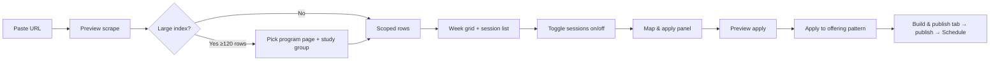
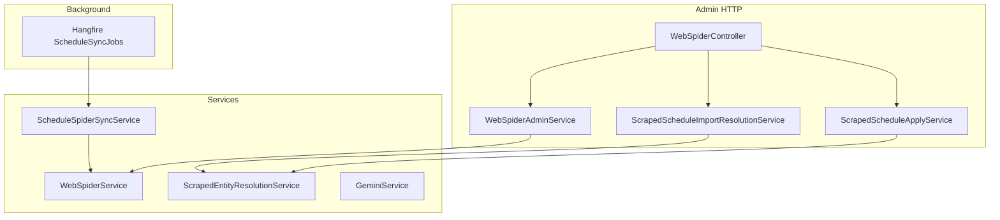

# Schedule import (web spider)

> Crawl public HTML timetable pages, **normalize day/time/frequency**, preview on a Mon–Fri week grid, **map scraped labels to Omada entities**, and optionally write **`WeeklySessionPlanJson`** on a term offering (Build tab) or sync rows into **`ScrapedClassEvent`** for reference.

**Admin route:** Timetables → **Import schedule** (`/timetables-workspace?tab=import`) only — there is **no** separate **Integrations / Web spider** item in admin nav or onboarding. Legacy URL `/web-spider-workspace` **redirects** to the Import tab.

**Related:** [`Timetables.md`](Timetables.md) · [`Configuration.md`](Configuration.md) · [`Backend.md`](Backend.md)

---

## Purpose (two outcomes)

| Outcome | Storage | Member Schedule? |
|---------|---------|------------------|
| **Map & apply to offering** | `CourseOffering.WeeklySessionPlanJson` | After **Build → publish** → `Event` |
| **Sync to DB (optional)** | `ScrapedClassEvent` | No — admin reference / migration only |

> ⚠️ **In-app calendar = `Event`.** Spider store = **`ScrapedClassEvent`**. Scraping alone does **not** fill member Schedule. Use **native timetables publish** ([`Timetables.md`](Timetables.md)) after patterns are on offerings.

> **News crawling removed from admin** — schedule import only. The News **widget** is unchanged; spider-based news sync/endpoints were removed from the admin API and UI.

---

## Admin import flow (Import tab)


```mermaid
flowchart LR
    A[Paste URL] --> B[Preview scrape]
    B --> C{Large index?}
    C -->|Yes ≥120 rows| D[Pick program page + study group]
    C -->|No| E[Scoped rows]
    D --> E
    E --> F[Week grid + session list]
    F --> G[Toggle sessions on/off]
    G --> H[Map & apply panel]
    H --> I[Preview apply]
    I --> J[Apply to offering pattern]
    J --> K[Build & publish tab → publish → Schedule]
```

### 1. Scrape scope

| Source page | Typical use |
|-------------|-------------|
| **Full index** (~2000+ rows) | Must narrow: pick **program/year page** (e.g. IE3) + **study group** (934, 935, 934/1) |
| **Year page** | Fewer rows; may still need group filter on large programs |
| **Group page** | Rows for one study group |
| **Single offering page** | Rows often show **activity only** (Curs, Laborator) — **course name is in the page title**, not each row |

**Dedup:** exact duplicate rows (same cells) are removed client-side. **Different subgroups** (934 vs 934/1) stay separate — do not merge cross-group rows.

### 2. Week grid preview

- **Mon–Fri only** — Saturday/Sunday parsed rows appear in the session list with stats (`weekend` count), not on the grid.
- Each scraped row gets its own grid block (no merge by day/time alone).
- Stats line example: `8 on week grid · 2 unparsed · 2 weekend (not on grid)`.
- **Reporting period** picker ties import to the term used for offering mapping.

**Frontend:** `ImportScheduleWeekPreview`, `utils/scrapedDisplaySlots.ts`, `utils/scrapedScheduleTiming.ts`.

### 3. Session toggles

- **Sessions** list: tap a row to **include/exclude** from import; **All / None** shortcuts.
- Only **enabled** sessions feed the week grid (filtered), mapping resolution, preview, and apply.

**Frontend:** `ImportScheduleSessionList`, `utils/scrapedSessionKey.ts`.

### 4. Map & apply (import wizard)

The Import tab uses a **step wizard** (`import-wizard/`) after scrape + scope:

| Step | Purpose |
|------|---------|
| **Context** | Import target (single course, study group, multi-course, etc.) |
| **Mapping** | Map scraped labels per section (subjects, activities, rooms, groups, professors); combo nav shows **unmapped counts** |
| **Review** | Preview apply across **all mapped offerings** (batch) before writing patterns |

**Create while mapping:** header actions on picker sheets (**New event type**, **New room**, **New group**, **Add course**) — not inline list options. Bottom sheets use **`importWizardSheetLayout.ts`** for scroll + height on web.

**Add course (unmapped subject):** **`ImportScheduleCreateOfferingSheet`** + **`importOfferingViaPackage.ts`** — adds course to a curriculum package and applies to the current period:

| Package mode | Program picker |
|--------------|----------------|
| **Existing package** | **Hidden** — uses programs already linked on the package |
| **Create new package** | **Required** — same program group as Offerings workspace |

Before writing the weekly pattern, admins review mappings:

| Scraped label | Maps to | Create new? |
|---------------|---------|-------------|
| **Activity** (Curs, Laborator, Seminar) | **Event type** | Yes — e.g. create "Lecture" |
| **Teacher / professor** | **Host** (org member) | Pick from full directory |
| **Room** | **Room** | Yes |
| **Study group** (934, IE3, 934/1) | **Program / series / group / subgroup** | Yes — choose type on create |
| **Course name** (multi-course imports) | **Term offering** | Pick from period catalog |
| **Target offering** | One **`CourseOffering`** for this apply | Required |

**Single-course pages:** enable **All rows → this offering** (auto-suggested when rows look activity-only). Backend **`ScrapedScheduleRowEnricher`** fills `ClassName` from page heading / offering name / implicit course hint — **only** when the row has no real discipline or is an exact activity label (`Curs`, `Laborator`, …).

**Multi-course group/year pages** (e.g. `IE3.html` with a **Disciplina** column): each row keeps its **Disciplina** text. Do **not** replace with the page code (`IE3`). See **Row enrichment pitfalls** below.

**Pickers:** full org catalogs (event types, hosts, rooms, groups, offerings) with **suggested matches** at the top. **Create & use** opens inline sheet for new event type, group (with type), or room.

**Frontend:** `ImportScheduleApplyPanel`, `ImportScheduleCreateEntitySheet`, `hooks/useImportScheduleMappingCatalogs.ts`.

**API client:** `WebSpiderClient.resolveImportMappings`, `previewApplyScrapedToOffering`, `applyScrapedToOffering` in `generatedClient.ts`. Temporary wrappers: `scrapedScheduleImportApi.ts`, `scrapedScheduleApplyApi.ts` — use path **`/web-spider/...`** with `apiClient` (base URL already includes `/api`; do **not** double-prefix `/api/api/...`).

---

## Architecture


```mermaid
flowchart TB
    subgraph Admin["Admin HTTP"]
        WC[WebSpiderController]
        WAS[WebSpiderAdminService]
        RES[ScrapedScheduleImportResolutionService]
        APP[ScrapedScheduleApplyService]
    end

    subgraph Jobs["Background"]
        HF[Hangfire ScheduleSyncJobs]
    end

    subgraph Services["Services"]
        WSS[WebSpiderService]
        SSS[ScheduleSpiderSyncService]
        SER[ScrapedEntityResolutionService]
        GEM[GeminiService]
    end

    WC --> WAS
    WC --> RES
    WC --> APP
    WAS --> WSS
    RES --> SER
    APP --> SER
    HF --> SSS
    SSS --> WSS
```

| Service | Role |
|---------|------|
| `WebSpiderService` | HTTP fetch, HtmlAgilityPack, table parse, page course heading, group heading |
| `WebSpiderAdminService` | Preview/discover/sync orchestration |
| `ScrapedScheduleImportResolutionService` | Suggestions: subjects, activities, professors, rooms, study groups |
| `ScrapedScheduleApplyService` | Preview/apply scoped rows → `WeeklySessionPlanJson` with user mappings |
| `ScrapedEntityResolutionService` | Professor → host, room text → room id |
| `ScheduleSpiderSyncService` | Hangfire merge → `ScrapedClassEvent` |
| `ScrapedScheduleRowEnricher` | Single-offering pages: activity-only rows → page/offering course hint; **never** substring-match discipline names (e.g. *Proiect de cercetare*) |
| `ScrapedScheduleNormalizer` + `ScheduleTimeParser` | `dayOfWeek`, `startTimeLocal`, `hoursPerSession`, `frequency` (`sapt1`, `sapt. 1`, `sapt. 2`, …) |

---

## Admin HTTP API

**Base:** `/api/web-spider`

| Method | Route | Auth | Behavior |
|--------|-------|------|----------|
| `GET` | `/config` | `admin` Admin | Org spider config (resolved URLs) |
| `PUT` | `/config` | `admin` Admin | Save schedule URL on Organization |
| `POST` | `/schedule/preview` | `admin` Admin | Site extraction (max 80 pages) |
| `POST` | `/schedule/discover` | `admin` Admin | Link map only |
| `POST` | `/schedule/sync` | `admin` Admin | Enqueue Hangfire schedule sync |
| `GET` | `/sync/history` | `admin` Admin | `SpiderSyncRun` history |
| `GET` | `/schedule/unresolved` | `admin` Admin | Rows with unresolved host/room |
| `POST` | `/schedule/import-resolution` | **Org Admin** | Mapping suggestions for scraped labels |
| `POST` | `/schedule/apply-to-offering/preview` | **Org Admin** | Preview weekly pattern from scoped rows |
| `POST` | `/schedule/apply-to-offering` | **Org Admin** | Write pattern to offering (Build tab) |

**Apply request highlights:** `periodId`, `offeringId`, `events[]`, `studyGroupLabel`, `replaceExistingSessions`, `importAllScopedRows`, `implicitCourseName`, `mappings` (`ScrapedImportMappingsDto`).

Responses: **`ServiceResponse<T>`** + **`AppError`**.

---

## Crawler behavior

### Hub / index pages (e.g. UBB tabelar)

1. Fetch index — if no rows, collect same-folder `.html` links
2. Visit linked pages until page cap
3. **Leaf tables only** — nested wrapper tables skipped to avoid duplicate rows
4. **Group heading** — nearest preceding `h1–h4` containing "grupa"
5. **Course heading** — nearest preceding heading that is not a group/year label (single-offering pages). **Reject** short program/year codes (`IE3`, `I1`, `M2`, …) via **`IsProgramOrGroupPageCode`**.
6. **Column map** — UBB-style headers: **Disciplina** → `ClassName`, **Tipul** → `ActivityType`. Time column matches **`orele`** or whole-cell **`ora`** — not the **`ora`** substring inside words like *Laborator*.
7. Each row: **`SourcePageUrl`**, **`ActivityType`**, **`GroupNumber`**

> ⚠️ If **`WasTruncated`** is true, use a **single year** or **group/offering URL** for full coverage.

### Time normalization

`ScheduleTimeParser` + frontend mirror in `scrapedScheduleTiming.ts` — Romanian/English day tokens, time ranges, biweekly hints.

**Frequency tokens:** `sapt1` / `sapt. 1` / `sapt 1` (week 1), `sapt2` / `sapt. 2` / `sapt 2` (week 2) → weekly or biweekly as appropriate.

### Row enrichment pitfalls (`ScrapedScheduleRowEnricher`)

| Pitfall | Correct behavior |
|---------|------------------|
| Discipline contains *proiect*, *seminar*, *laborator*, *curs* | **`IsActivityOnlyLabel`** = **exact** match on activity tokens only — *Proiect de cercetare* is a course name, not activity-only |
| Page title / URL is program code (`IE3`) | **`IsProgramOrGroupPageCode`** — never use as `ClassName` on multi-course tables |
| ≥2 distinct discipline names in scrape | **`ResolveImplicitCourseNameAsync`** returns null — no single implicit course from URL |
| Single-offering page, row is only `Laborator` | Enricher moves activity to **`ActivityType`**, fills **`ClassName`** from page heading / selected offering |

---

## Key DTOs (`DTOs/Scraping/`)

| Type | Purpose |
|------|---------|
| `ScrapedEventDto` | ClassName, Time, Room, Professor, GroupNumber, ActivityType, SourcePageUrl, normalized time fields |
| `ScrapedImportResolutionRequest/ResultDto` | Mapping suggestions per label |
| `ScrapedImportMappingsDto` | User-confirmed maps (activity→event type, professor→host, room, study group) |
| `ApplyScrapedScheduleRequest` | Apply/preview payload |
| `SpiderPreviewScheduleResultDto` | Preview: events + pages + truncation |
| `SpiderConfigDto` | Org URL config |

---

## Schedule merge pipeline (Hangfire sync)

```text
1. Resolve URL (SpiderUrlResolver — DB → appsettings)
2. Extract (ExtractScheduleFromSiteAsync)
3. Hash each row (ScrapedEventHasher)
4. Natural key: ClassName + Time + GroupNumber
5. Resolve HostId / RoomId
6. Upsert ScrapedClassEvent
```

Tenancy: Hangfire uses explicit `OrganizationId` — no HTTP user context.

---

## Mobile file map

| Path | Purpose |
|------|---------|
| `screens/admin/timetables-workspace/components/TimetablesImportTab.tsx` | Import tab shell |
| `ImportScheduleScopePanel.tsx` | Large-scrape program + group picker |
| `ImportScheduleWeekPreview.tsx` | Week grid + period picker |
| `ImportScheduleSessionList.tsx` | Rows + include/exclude toggles |
| `ImportScheduleApplyPanel.tsx` | Legacy map & apply (superseded by wizard where enabled) |
| `ImportScheduleCreateOfferingSheet.tsx` | Add course via package during mapping |
| `import-wizard/` | Context · Mapping · Review steps; **`importOfferingViaPackage.ts`** |
| `ImportScheduleCreateEntitySheet.tsx` | Create event type / group / room from mapping pickers |
| `utils/importScheduleScope.ts` | Scope catalog + filters |
| `utils/scrapedEventDedup.ts` | Exact row dedup |
| `utils/scrapedDisplaySlots.ts` | Grid slots + parse stats |
| `utils/scrapedSessionKey.ts` | Per-row toggle keys |
| `screens/admin/web-spider-workspace/` | Shared scrape UI (`WebSpiderScheduleTab`, discovery list) |

---

## Backend file map

| File | Purpose |
|------|---------|
| `Services/WebSpiderService.cs` | Crawl + table extraction + headings |
| `Services/WebSpiderAdminService.cs` | Admin orchestration |
| `Services/ScrapedScheduleImportResolutionService.cs` | Import mapping suggestions |
| `Services/ScrapedScheduleApplyService.cs` | Apply to `WeeklySessionPlanJson` |
| `Services/ScrapedEntityResolutionService.cs` | Host/room fuzzy match |
| `Infrastructure/Scraping/ScrapedScheduleRowEnricher.cs` | Single-course enrichment; **`IsProgramOrGroupPageCode`**; exact **`IsActivityOnlyLabel`** |
| `Infrastructure/Scraping/ScheduleTimeParser.cs` | Day/time/frequency parse (`sapt. 1`, `sapt. 2`, …) |
| `Infrastructure/Scraping/ScrapedScheduleDedup.cs` | Server-side dedup helpers |
| `Controllers/WebSpiderController.cs` | HTTP surface |
| `Services/ScheduleSpiderSyncService.cs` | Hangfire → `ScrapedClassEvent` |

Registered in `Program.cs`: `IScrapedScheduleApplyService`, `IScrapedScheduleImportResolutionService`.

---

## Operational notes

| Topic | Guidance |
|-------|----------|
| **Member Schedule** | Apply → **Build & publish** → **publish** per offering |
| **404 on import API** | Restart API after deploy; frontend must call `/web-spider/...` via `apiClient`, not `/api/web-spider/...` |
| **NSwag** | Regenerate after DTO/route changes: `cd src/frontend/mobile && npm run generate-api` |
| **Hangfire** | Optional **Sync to DB** at `/hangfire` — separate from map & apply |
| **Rate limits** | Crawl caps + timeouts — use only authorized institutional pages |

---

*Update this file when adding spider endpoints, import mapping fields, crawl behavior, or admin UI flows.*
