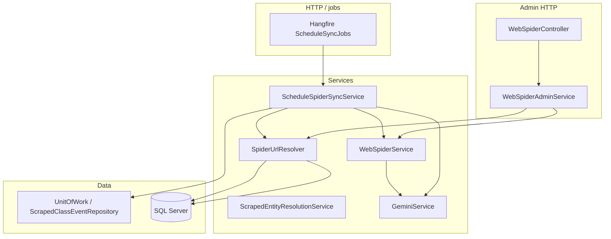

# Omada Web Spider — Documentation

This document describes the **Web Spider** subsystem in `src/backend/Omada.Api/`: crawling public HTML, extracting **timetable rows** and **news articles**, **merging** schedules into the database with hash-based change detection, **entity resolution** (host + room), optional **Google Gemini** fallbacks, **Hangfire** background jobs, and the **mobile admin workspace** used to configure URLs and preview results.

**Related:** [Configuration.md](Configuration.md) (`.env`, `appsettings`, mobile API URL) · [Root README](../README.md)

---

## 1. Purpose

| Capability | Role |
|------------|------|
| **Schedule discovery** | Breadth-first crawl of same-host links; classify pages as **menu** vs **schedule** (HTML table heuristics). |
| **Schedule extraction (single page)** | Parse timetable-like `<table>` grids (rowspan/colspan) into `ScrapedEventDto`. Romanian and English column headers supported (e.g. Ziua, Orele, Disciplina, Sala, Formatia, Cadrul didactic, Tipul). |
| **Schedule extraction (site / hub)** | When the start URL is an **index** (no rows on first page), pre-queue same-directory `.html` links (e.g. UBB `tabelar/index.html` → `I1.html`, `M2.html`) and scrape up to a configurable page cap. |
| **News discovery** | Crawl with news-oriented heuristics (paths, `<article>`, archives). |
| **News extraction** | Strip boilerplate, extract title + body; optional **Gemini** `NewsCategory` triage. |
| **Persistence & merge** | Hangfire job loads org schedule URL → **site extraction** → **upsert** `ScrapedClassEvent` by natural key + **SHA-256 hash**; resolve **HostId** / **RoomId** in batch + cache. |
| **Admin preview API** | Authenticated endpoints for org admins to save URLs, preview scrape, discover links, and enqueue sync without editing `appsettings.json`. |

The in-app calendar entity is **`Event`**. Persisted spider timetable snapshots live in **`ScrapedClassEvent`** (separate table). The admin UI previews scraped rows before sync.

---

## 2. High-level architecture


```mermaid
flowchart TB
    subgraph Admin["Admin HTTP"]
        WC[WebSpiderController]
        WAS[WebSpiderAdminService]
    end

    subgraph HTTP["HTTP / jobs"]
        HF[Hangfire ScheduleSyncJobs]
    end

    subgraph Services["Services"]
        WSS[WebSpiderService]
        SSS[ScheduleSpiderSyncService]
        SUR[SpiderUrlResolver]
        SER[ScrapedEntityResolutionService]
        GEM[GeminiService]
    end

    subgraph Data["Data"]
        UOW[UnitOfWork / ScrapedClassEventRepository]
        DB[(SQL Server)]
    end

    WC --> WAS
    WAS --> WSS
    WAS --> SUR
    HF --> SSS
    SSS --> WSS
    SSS --> SUR
    SSS --> GEM
    WSS --> GEM
    SSS --> UOW
    SUR --> DB
    SUR --> DB
```

- **`WebSpiderService`**: HTTP fetch (injected `HttpClient`), HtmlAgilityPack parsing, discovery, single-page and multi-page schedule extraction, news extraction.
- **`WebSpiderAdminService`**: Org-scoped preview/discover/sync orchestration for the admin API.
- **`SpiderUrlResolver`**: Resolves schedule/news URLs — **database first** (`Organization.SpiderSchedulePageUrl`, `Organization.SpiderNewsStartUrl`), then `appsettings.json` fallback for schedule only.
- **`ScheduleSpiderSyncService`**: Uses **`ExtractScheduleFromSiteAsync`** (not single-page only), resolution maps, hash upsert.
- **`GeminiService`**: Generative Language API for news categories and schedule JSON fallback when DOM parsing fails.

---

## 3. URL configuration

### 3.1 Database (preferred)

| Column | Entity | Purpose |
|--------|--------|---------|
| `SpiderSchedulePageUrl` | `Organization` | Timetable index or year page (e.g. UBB tabelar index or `I1.html`). |
| `SpiderNewsStartUrl` | `Organization` | News site entry URL for discovery/preview. |

Migration: `AddOrganizationSpiderUrls`.

Saved via **`PUT /api/web-spider/config`** (`SaveSpiderConfigRequest`). The mobile **Web crawling** workspace calls this so admins do not need to edit server config files.

### 3.2 appsettings.json (fallback)

Used when the organization has **no** schedule URL in the database:

```json
{
  "Spider": {
    "DefaultSchedulePageUrl": "https://example.edu/orar",
    "Organizations": {
      "00000000-0000-0000-0000-000000000001": {
        "SchedulePageUrl": "https://org-specific/orar"
      }
    }
  },
  "Gemini": {
    "ApiKey": "",
    "Model": "gemini-2.0-flash"
  }
}
```

**News URLs** are not read from appsettings; they must be saved per organization in the DB (or passed on each preview/discover request where supported).

Set the Gemini API key via **`Gemini:ApiKey`** in `appsettings`, **`Gemini__ApiKey`** or **`GEMINI_API_KEY`** in `src/backend/Omada.Api/.env`, or user secrets. See [Configuration.md](Configuration.md).

---

## 4. Admin HTTP API (`WebSpiderController`)

Base route: **`/api/web-spider`**. All endpoints require authentication and **`admin` widget + Admin** permission (`[HasPermission(WidgetKeys.Admin, AccessLevel.Admin)]`).

| Method | Route | Behavior |
|--------|-------|----------|
| `GET` | `/config` | Returns `SpiderConfigDto` for the active organization (resolved URLs + flags). |
| `PUT` | `/config` | Saves `schedulePageUrl` / `newsStartUrl` on `Organization`. |
| `POST` | `/schedule/preview` | **`ExtractScheduleFromSiteAsync`** with `maxSchedulePages: 80`. Returns `SpiderPreviewScheduleResultDto` (events, per-page summaries, truncation flags). |
| `POST` | `/schedule/discover` | **`DiscoverLinksAsync`** — link map only, no row extraction. |
| `POST` | `/schedule/sync` | Enqueues Hangfire `ScheduleSyncJobs.SyncScheduleDatabaseAsync(orgId)`. Optional body URL is saved to config first. |
| `POST` | `/news/preview` | Fetches one article URL, returns `SpiderPreviewNewsResultDto`. |
| `POST` | `/news/discover` | **`DiscoverNewsLinksAsync`** from saved or request news URL. |
| `POST` | `/news/sync` | Enqueues news sync into `NewsItem` (dedup by source URL/hash). |
| `GET` | `/sync/history` | Paginated **`SpiderSyncRun`** history for the active org. |
| `GET` | `/schedule/unresolved` | Scraped rows with unresolved host/room matches for admin review. |

Request bodies use **`SpiderUrlRequest`** (`url` optional when a saved org URL exists).

Responses use **`ServiceResponse<T>`** + **`AppError`** like the rest of the API.

---

## 5. `IWebSpiderService` — crawler API

| Method | Behavior |
|--------|----------|
| `DiscoverLinksAsync(startUrl)` | BFS same-host links, classify each page (`SpiderPageKind`), cap ~250 pages. |
| `ExtractScheduleFromTableAsync(html)` | **Primary:** parse schedule-like table(s) on one HTML document. **Fallback:** Gemini JSON from stripped text if structure changed / zero rows. |
| `ExtractScheduleFromSiteAsync(startUrl, maxSchedulePages)` | Multi-page crawl: scrape start page; if index/hub, enqueue same-directory `.html` links; aggregate rows. Returns `SiteScheduleExtractionResult` with `HubLinksDiscovered`, `SchedulePagesScraped`, `WasTruncated`, `Pages[]`. Default interface default `maxSchedulePages = 32`; admin preview uses **80**, Hangfire sync uses **120**. HTTP fetch cap **120** per run. |
| `FetchSchedulePageHtmlAsync(url)` | GET HTML (used by sync and news preview). |
| `DiscoverNewsLinksAsync(startUrl)` | News-oriented BFS, cap ~200 pages, `NewsPageKind` per URL. |
| `ExtractNewsArticleAsync(html)` | Title + body; optional Gemini `NewsCategory`; failures do not crash the scraper. |

### 5.1 Hub / index pages (e.g. UBB)

Typical flow for `https://www.cs.ubbcluj.ro/files/orar/2025-1/tabelar/index.html`:

1. Fetch index; if no timetable rows, collect **all same-folder `.html` links** on the same host.
2. Visit each linked year/specialization page until `maxSchedulePages` or HTTP cap is reached.
3. Each row includes **`SourcePageUrl`** (e.g. `I1.html`) and **`ActivityType`** (Curs, Laborator, Seminar) when the table has a type column.

If **`WasTruncated`** is true, preview shows a warning — use a **single year URL** for full coverage of that program.

---

## 6. DTOs (`DTOs/Scraping/`)

| Type | Purpose |
|------|---------|
| `ScrapedEventDto` | `ClassName`, `Time`, `Room`, `Professor`, `GroupNumber`, **`ActivityType`**, **`SourcePageUrl`**. |
| `SpiderPreviewScheduleResultDto` | Preview response: events + `Pages`, `HubLinksDiscovered`, `SchedulePagesScraped`, `WasTruncated`, `CrawledMultiplePages`. |
| `ScrapedSchedulePageSummaryDto` | Per-URL summary: `SourceUrl`, `EventCount`, `PageKind`. |
| `SiteScheduleExtractionResult` | Internal result of `ExtractScheduleFromSiteAsync`. |
| `SpiderConfigDto` / `SaveSpiderConfigRequest` | Org URL config for admin UI. |
| `SpiderDiscoveryResult` / `DiscoveredPageDto` / `SpiderPageKind` | Schedule link discovery. |
| `NewsDiscoveryResult` / `DiscoveredNewsPageDto` / `NewsPageKind` | News link discovery. |
| `ExtractedNewsArticleDto` | News preview body + category. |
| `SpiderSyncEnqueueResultDto` | Hangfire `jobId` + message. |

---

## 7. Schedule merge pipeline (`ScheduleSpiderSyncService`)

1. **Resolve URL** — `ISpiderUrlResolver.ResolveSchedulePageUrl(organizationId)` (DB → appsettings).
2. **Extract** — `ExtractScheduleFromSiteAsync(url, maxSchedulePages: 120)`.
3. **Hash** — `ScrapedEventHasher.CalculateHash(dto)` per row.
4. **Natural key** — `ClassName` + `Time` + `GroupNumber` (normalized whitespace, case-insensitive).
5. **Resolution** — `IScrapedEntityResolutionService.BuildMapsAsync` → `HostId` / `RoomId` on `ScrapedClassEvent`.
6. **Upsert** — insert / update when hash changes / delete rows missing from latest scrape.
7. **`SaveChanges`** — `IUnitOfWork.CompleteAsync`.

**Tenancy:** Hangfire runs without HTTP user; queries use explicit `OrganizationId` filters.

Enqueue from API:

```csharp
BackgroundJob.Enqueue<ScheduleSyncJobs>(j => j.SyncScheduleDatabaseAsync(organizationId));
```

---

## 8. Gemini behavior

### 8.1 News categorization

- Prompt lists `NewsCategory` values; response parsed to enum; missing key → `General`.

### 8.2 Schedule fallback (JSON)

- Used when HtmlAgilityPack cannot produce rows (`HtmlStructureChangedException` or empty grid).
- Expects JSON **array** of objects with **`ClassName`, `Time`, `Room`, `Professor`, `GroupNumber`** (strings).
- Failure → empty list for that page.

**Configuration:** `Gemini:ApiKey` (or `GEMINI_API_KEY` in `.env`), `Gemini:Model` (e.g. `gemini-2.0-flash`). See [Configuration.md](Configuration.md).

---

## 9. Mobile admin UI

| Path | Purpose |
|------|---------|
| `src/frontend/mobile/src/app/(app)/(admin)/web-spider-workspace.tsx` | Expo route |
| `src/frontend/mobile/src/screens/admin/web-spider-workspace/` | Screen, hooks, tabs, preview components |
| `src/frontend/mobile/src/screens/admin/components/org-dashboard.tsx` | **Web crawling** entry (separate from floorplan extraction) |

### 9.1 Workspace features

- **Schedule tab**: Save URLs, preview, discover, sync to DB (Hangfire), **sync history**, unresolved entity matches.
- **News tab**: News URL, article preview, discover, **news sync**, sync history.
- **Schedule preview**: Grouped collapsible sections; **Filters & layout** sheet (organize by group, program/year, subject, session type, teacher, day; searchable “Show only” picker).
- **Web**: Filter sheets use `Modal` + fixed positioning in `BottomSheet` so overlays stay in the viewport (not at the bottom of a long scroll page).

### 9.2 API client

- Generated: `WebSpiderClient` in `src/frontend/mobile/src/api/generatedClient.ts`.
- Regenerate when the API is running: `cd src/frontend/mobile && npm run generate-api`.
- Config/sync helpers may also exist in `src/frontend/mobile/src/api/webSpiderApi.ts` / `webSpiderConfigApi.ts` until NSwag output is fully aligned.

---

## 10. File inventory (backend)

### Core

| File | Purpose |
|------|---------|
| `Services/WebSpiderService.cs` | Crawls, table parsing, site extraction, news extraction, Gemini fallback. |
| `Services/Interfaces/IWebSpiderService.cs` | Crawler contract. |
| `Services/WebSpiderAdminService.cs` | Admin preview/discover/sync. |
| `Services/Interfaces/IWebSpiderAdminService.cs` | Admin contract. |
| `Controllers/WebSpiderController.cs` | HTTP surface (§4). |
| `Services/SpiderUrlResolver.cs` | DB + appsettings URL resolution. |
| `Services/Interfaces/ISpiderUrlResolver.cs` | URL resolver contract. |

### Sync, resolution, Gemini

| File | Purpose |
|------|---------|
| `Services/ScheduleSpiderSyncService.cs` | Hash merge into `ScrapedClassEvent`. |
| `Services/ScrapedEntityResolutionService.cs` | Professor → host, room text → room. |
| `Services/GeminiService.cs` | News + schedule AI fallbacks. |
| `Infrastructure/Hangfire/ScheduleSyncJobs.cs` | Hangfire entry point. |
| `Infrastructure/Scraping/ScrapedEventHasher.cs` | SHA-256 change detection. |
| `Infrastructure/Scraping/HtmlStructureChangedException.cs` | Triggers Gemini schedule fallback. |

### Persistence

| File | Purpose |
|------|---------|
| `Entities/ScrapedClassEvent.cs` | Org-scoped scraped rows + `DataHash`, FKs. |
| `Services/NewsSpiderSyncService.cs` | News crawl → `NewsItem` (source URL/hash dedup). |
| `Services/SpiderSyncRunService.cs` | Sync run history for admin UI. |
| `Entities/SpiderSyncRun.cs` | Per-run status, counts, errors. |
| `Entities/Organization.cs` | `SpiderSchedulePageUrl`, `SpiderNewsStartUrl`. |
| `Repositories/ScrapedClassEventRepository.cs` | Data access. |

---

## 11. Dependency injection (`Program.cs`)

- `AddHttpClient<IWebSpiderService, WebSpiderService>` — timeout 45s, custom User-Agent.
- `AddHttpClient<IGeminiService, GeminiService>`
- `AddScoped<IWebSpiderAdminService, WebSpiderAdminService>`
- `AddScoped<ISpiderUrlResolver, SpiderUrlResolver>`
- `AddScoped<IScheduleSpiderSyncService, ScheduleSpiderSyncService>`
- `AddScoped<IScrapedEntityResolutionService, ScrapedEntityResolutionService>`
- `AddSingleton<ScheduleSyncJobs>`
- Hangfire SQL storage + server; dashboard at **`/hangfire`** (secure in production).

---

## 12. Operational notes

- **Hangfire dashboard** — `/hangfire` — monitor `SyncScheduleDatabaseAsync` jobs after **Sync to DB**.
- **Rate limits & ethics** — Crawl caps and HTTP timeouts limit load; use only for **authorized** institutional pages.
- **Truncation** — Large indexes may hit page caps; prefer a specific year page for complete preview/sync of one program.
- **NSwag** — Regenerate the mobile client after DTO or endpoint changes.
- **Floorplan AI** — Roboflow extraction in `Omada.Api` (`RoboflowFloorplanGeoJsonExtractor`); not part of the web spider. Config: [`Configuration.md`](Configuration.md).

---

## 13. Change log (feature areas)

Evolution: **ScrapedClassEvent** → **Hangfire** → **hash merge** → **host/room resolution** → **Gemini** news + schedule fallback → **admin API + DB URLs** → **`ExtractScheduleFromSiteAsync`** hub crawl → **`ActivityType` / `SourcePageUrl`** → **mobile admin workspace** with grouped preview and filter sheets.

---

*Update this file when adding spider endpoints, DTO fields, crawl behavior, or admin UI flows.*
